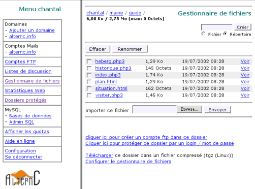

**AlternC comme si vous y étiez, le livre :**

* [Introduction par Laurent Chemla, Chantal Bernard-Putz & Benjamin Sonntag](Book-intro-laurent-chemla-fr)
* [Chapitre 3-4, Un peu d'histoire](Book-chapitre-3-histoire-fr)
* [Chapitre 5, guide utilisateur](Book-chapitre-5-guide-utilisateur-fr)
* [Chapitre 6, guide administrateur](Book-chapitre-6-guide-administrateur-fr)
* [Chapitre 7-8, guide avancé, trucs & astuces](Book-chapitre-7-guide-avance-fr)
* [Annexe, ils utilisent et contribuent à AlternC](Book-annexe-ils-utilisent-alternc-fr)

Chapitre III - Un peu d'histoire
================================

Au début était altern.org...
----------------------------

Valentin Lacambre, créateur d'altern.org, nous raconte la naissance de
ce projet :

> « Altern a commencé en 1992 comme un service d'accès à internet, par
> minitel et téléphone. Ce qui m'a causé beaucoup d'amis me demandant
> d'héberger leur site web. les amis en question n'étant pas 'compatible
> avec ftp', un moyen simple d'administrer son site web devenait
> nécessaire. Altern.org, ouvert en 1995, permettait d'héberger un site
> facilement, l'ensemble de la gestion quotidienne s'opérant au travers
> de formulaires web. »

C'est donc de l'hébergement altern.org qu'est né cette idée de gérer
simplement un site web à base de formulaire web, le tout devant rester
accessible aux personnes non initiées.

> « Quelques années et cinquante mille sites web plus tard, [altern.org](altern.org)
> devait fermer ses portes sous la pression de ceux qui voulaient faire
> taire les amis de mes amis. Mes locataires se retrouvant à la rue avec
> comme seule perspective de point de chute des boutiques clinquantes,
> j'ai aidé d'autres fous à ouvrir des services semblables, en donnant
> les logiciels et l'aide que je pouvais leur apporter. »

Altern.org hébergeait une foule de petits sites en HTML simple, dont des
sites d'écoles égayant leurs pages web d'illustrations aussi mignonnes
que recopiées d'ouvrages protégés par le droit d'auteur, ou des sites
personnels publiant parfois des photos osées de stars en vue...

Altern.org perdit plusieurs procès, notamment contre les héritiers de
Caliméro. Le procès en trop fut celui contre Estelle Hallyday, au cours
duquel le juge décida que l'hébergeur était responsable des contenus
qu'il hébergeait.

Les enfants d'Altern
--------------------

Valentin, contraint de fermer l'hébergement web gratuit
[altern.org](http://altern.org) lance un appel pour la poursuite d'un projet
préservant la liberté sur un Internet non marchand.
C'est dans le courant de l'année 2000 qu'une vingtaine de personnes
répondent à cet appel et mettent en place une liste de discussion.

Deux aspects sont alors envisagés :

* L'aspect technique. En effet, la plateforme altern de l'époque est codée en php2, elle doit donc être remaniée profondément.
* L'aspect politique. Notamment la structure juridique du projet.

C'est sur ce second aspect que se sépareront les tenants d'un projet
coopératif (Ouvaton) et ceux d'un projet associatif autogéré (Lautre),
début 2001.

> Valentin conclut ainsi : « l'Apinc [apinc.org](http://apinc.org), Ouvaton
> [ouvaton.coop](https://ouvaton.coop), et Lautre Net [lautre.net](https://lautre.net)
> sont nés  de ce clonage, le logiciel de gestion  de sites d'[altern.org](http://altern.org)
> sera complètement transformé par l'équipe de développeurs de Lautre Net et
> donnera naissance à AlternC. »

Les chemins de traverse : Lautre.Net laboratoire d'AlternC
----------------------------------------------------------

AlternC voit donc le jour en mai 2001, comme projet de Lautre.Net,
structure autogérée.

Pourquoi un « C » dans AlternC ?

Il y a eu Altern : hébergement web gratuit, il y a AlternB : hébergement
professionnel, tous deux lancés par Valentin Lacambre.

AlternC est donc un nom évident, et pas seulement pour la suite
alphabétique mais également pour l'initiale du mot Clone. En effet, le
projet politique de AlternC/Lautre.Net prévoit le « clonage » de
structures d'hébergement similaire : la liberté sur Internet est
également liée à la multiplication des structures d'hébergement.
Lautre.net inclus d'ailleurs cette résolution dans ses statuts.

Valentin Lacambre offre son premier serveur à Lautre.net, serveur
baptisé « Estelle » (clin d'oeil aux [déboires juridiques d'Altern.org !](http://altern.org/alternb/defense/faq.html)).

Ce serveur est hébergé gracieusement pendant une année par Globenet,
association présentée par ailleurs dans cet ouvrage.

Lautre.net ouvre son service d'hébergement le 11 novembre 2001.

La cotisation est fixée à 23 euros par an, elle n'a pas bougé depuis.
L'association démarre rapidement avec 150 comptes utilisateurs. Elle
comprend quatre administrateurs système, trois à quatre « administratifs
» dont un trésorier, tous bénévoles et une liste « assemblée »
regroupant tous les membres.

Les logiciels de gestion des serveurs sont réécrits et petit à petit
améliorés, toujours en utilisant le duo PHP / Mariadb.

Voici un des premiers bureaux AlternC affichant le gestionnaire de
fichiers. La présentation est spartiate, mais déjà facile à utiliser
pour un non informaticien un tant soit peu intéressé par l'informatique.

Certaines discussions font exploser le traffic sur la liste assemblée
regroupant tous les membres. Suite à diverses demandes, une liste «
débats » est donc mise en place. Elle accueille les discussions
annoncées sur la liste « assemblée », chacun étant libre de s'inscrire
ou de se désinscrire sur cette nouvelle liste en fonction du thème des
discussions.

En novembre 2002, l'assemblée de Lautre.Net décide de modifier les
statuts de l'association en remplaçant le bureau et le CA par un bureau
solidaire, auquel les membres sont invités à participer. Il n'y a donc
plus de président ou de poste similaire.

Afin de répartir au mieux les tâches au sein de la structure, les
administrateurs système et les trésoriers ne font pas partie de ce
bureau solidaire. Dans le même temps, il est décidé de baisser le nombre
de comptes avant « clonage » de 5 000 à 2 000. L'indépendance technique
vivement souhaitée par tous est de plus en plus réelle. Dans cette
optique, tout en continuant à fonctionner de manière satisfaisante pur
les comptes hébergés, les inscriptions sont fermées pendant environ 2
ans. Ce temps de fermeture est mis à profit pour réorganiser
l'architecture technique et la sécuriser au maximum. Parallèlement,
Lautre.net prend son indépendance en installant ses serveurs en salle
machine, indépendamment de Globenet, fin 2004.

Au moment ou nous écrivons ces lignes, Lautre Net compte un millier de
membres, héberge plus de 2200 noms de domaines, autant de boites mail,
et fonctionne de manière satisfaisante.

Du côté des développements, des extensions à AlternC ont été écrites
spécifiquement pour L’Autre Net : outil de vote, gestion des cotisations
à l'association, des abonnements aux listes « Débats » et
« Assemblée »... D'autres modules ont enrichi le panneau web par la
suite : service de messagerie Jabber, machines virtuelles permettant un
accès SSH et le lancement de commandes Linux etc.

Chapitre IV - AlternC aujourd'hui
=================================

Le chapitre précédent résumait l'aventure qui a conduit à la réalisation
d'AlternC.

Depuis plusieurs années AlternC est arrivé à maturité et poursuit son
évolution, fort d'une communauté internationale : concepteurs,
gestionnaires, développeurs, documentalistes, traducteurs, utilisateurs
débogueurs...

AlternC et les associations
---------------------------

### Les premiers utilisateurs

Outre Lautre.net, plusieurs structures associatives proposent des
hébergements sous architecture AlternC.

Bien évidemment, Globenet qui accueillit notre premier serveur fut l'une
des premières à utiliser AlternC et l'utilise encore à ce jour.

L'association belge Domaine Public, à son tour, a rapidement utilisé
AlternC, et a contribué à l'époque aux évolutions du logiciel.

### La traversée des océans

L'Association Québécoise Koumbit s'est très tôt intéressée à AlternC.
L'un de ses membres est devenu un contributeur très actif.

C'est à cette même époque qu'une ONG africaine a choisi AlternC pour
héberger ses antennes locales et de nombreuses autres associations
sénégalaises.

Depuis, 3 structures africaines différentes utilisent AlternC sur des
serveurs dédiés ou mutualisés.

AlternC et les professionnels de l'hébergement
----------------------------------------------

En France, plusieurs hébergeurs professionnels utilisent AlternC et
contribuent activement à son évolution.

[Octopuce, hébergeur infogéré, opérateur Internet et société de services en logiciels libres](https://www.octopuce.fr) a participé aux développements
d'AlternC dès sa fondation.

[Neuronnexion](neuronnexion.coop) et [Webelys](http://www.Webelys.com)sont
également des hébergeurs professionnels contributeurs d'AlternC.

Les clients de ces hébergeurs sont souvent des agence web ou d'autres
sociétés qui, elles-même, hébergent de nombreux clients sur leur
infrastructure AlternC.

Un rapide sondage auprès des structures contributrices, pour celles qui
nous ont répondu, fait état de 250 AlternC installés (sur un serveur ou
une ferme de serveurs), soit 9500 comptes hébergeant 35 000 noms de
domaine et 88 000 boites mail pop/imap.

Bien évidemment, nous avons connaissance de plusieurs autres petites
sociétés utilisant AlternC pour des hébergements. Celles-ci n'ayant
jamais établi de contact avec l'équipe des développeurs d'AlternC, nous
ne disposons d'aucune donnée les concernant.

Témoignages d'utilisateurs
--------------------------

### René Mages, Président de la FFII France [ffii.fr]( www.ffii.fr )

La FFII France nous avons le plaisir d'utiliser AlternC depuis plusieurs
années. Nous y sommes très attachés et les raisons en sont multiples. La
première d'entre elles est la simplicité d'utilisation y compris par des
personnes qui n'ont aucune expertise en administration système. La
seconde toute aussi importante concerne la rapidité d'exécution de
tâches qui d'ordinaire relèvent du lancement de commandes en ligne assez
techniques.

La création d'une liste de diffusion donne une illustration dans
laquelle simplicité et rapidité sont à l'œuvre. En quelques minutes un
administrateur non chevronné mettra en place une liste et ses
principales options (un archivage public ou privé par exemple). Il en va
de même pour ce qui concerne la création d'une base de données, d'un
compte ftp ou encore d'une adresse courriel. Modifier à la volée un
fichier html ou php est presque un jeu d'enfant sans parler de la
création d'un répertoire (ou du paramétrage de ses droits d'accès).

AlternC s'est peu à peu enrichi de nouvelles fonctionnalités telle que
la gestion des politiques de mot de passe. En clair l'administrateur
d'AlternC peut paramétrer comme il le souhaite le niveau minimal de
complexité dans le choix des mots de passe de l'ensemble des
utilisateurs.

Une structure associative comme la FFII dispose de moyens financiers
modiques pour lutter contre les nombreuses dérives en matière de
brevetage (les fameux brevets logiciels...) c'est pourquoi nous avons
préféré un hébergement mutualisé chez Lautre.net pour la simple raison
qu'AlternC est immédiatement utilisable (pas d'installation préalable
comme cela est le cas pour la plupart des hébergements dédiés). AlternC
nous donne pleinement satisfaction comme tous les logiciels libres que
nous utilisons.

### Jean Marc Manach, Journaliste

En l'an 2000, Altern fermait les 48 000 sites web qu'il hébergeait
(gratuitement), refusant de cautionner une loi qui oblige les
responsables de sites web à décliner leur identité afin d'avoir le droit
de s'exprimer.

Valentin Lacambre décidait alors de « cloner » Altern, ce qui donna
AlternC, né de la liberté d'expression, ce qui fait toute sa différence.
Là où un hébergeur « classique » propose en effet de payer un supplément
pour disposer d'une mailing-liste, d'un (sous-)nom de domaine ou
d'adresses e-mails supplémentaires, AlternC permet a contrario aux
administrateurs de sites web de prendre la main, en mode « tout en un »,
sur leurs propres données.

Paraphrasant le vieux dicton, « Offrez un nom de domaine à un homme et
vous le nourrirez pour un jour. Apprenez-lui à l'administrer et vous le
nourrirez pour toute la vie. »

Auteur de : La vie privée, un problème de « vieux cons »

([http://j.mp/dt0OFr](http://j.mp/dt0OFr))

Micro :([Twitter](http://twitter.com/manhack))

Blog :( [http://bugbrother.net](http://bugbrother.net/)) &
([http://bigbrotherawards.eu.org](http://bigbrotherawards.eu.org/))

Boss :( [http://internetactu.net](http://internetactu.net/))

### Philippe Tchénio, Chirurgien de la main

J'ai fait appel à un hébergeur professionnel utilisant AlternC en 2004 à
la suite d'un « Hack » du forum sos-mains, forum médical dédié aux
pathologies de la chirurgie de la main et du membre supérieur, hébergé à
l'époque chez un hébergeur « grand public ». Ce contact avec la
« piraterie » fut extrêmement désagréable pour nous car certaines
données sensibles furent perdues : des cas cliniques de patients ont
tout simplement disparus, du fait d'une gestion non adaptée à la
spécificité médicale du forum et d'un certain manque d'expérience.

Suite à la migration sur un compte AlternC nous n'avons plus d'accident
de ce genre à déplorer. Bien au contraire, sur les conseils avisés de
l'équipe, la connexion au forum se fait actuellement de manière
sécurisée (https).

L'interface AlternC me permet d'accéder à l'ensemble des applications de
gestion du Forum au quotidien :

* d'abord la base SQL qui m'autorise une gestion plus fine des utilisateurs
* ensuite les listes de diffusion (mailman) outil puissant qui me permet de faire vivre le forum en prévenant les membres inscrit dés l'apparition d'un nouveau cas clinique.
* Le gestionnaire de fichier qui m'a permis de personnaliser l'interface du forum, sans logiciel FTP
* Les statistiques Web toujours intéressantes, que j'ai utilisées à plusieurs reprises pour des communications à des congrès médicaux

AlternC est riche d'autres fonctions que j'utilise plus rarement et m'a
permis entre autre d'installer des applications tierces open source, par
exemple Limesurvey afin de proposer des questionnaires spécialisés sous
forme de sondages ludiques.

[SOS-Main](https://www.sos-mains.com/)

### Pierre Emmanuel Sudres, Agence de Communication

L'agence Esteve Communication est spécialisée dans l'accompagnement des
PME qui souhaitent utiliser à plein le web dans leur communication.
Notre métier est axé sur la fourniture de contenu éditorial et le
référencement. Mais pour répondre aux besoins exprimés, Esteve
Communication, dès 2000, a souhaité faire bénéficier ses clients d'une
offre d'hébergement intégrée avec un serveur dédié. N'ayant pas de
compétences poussées en gestion de serveur, L'agence s'est tournée vers
la solution AlternC après avoir testé sans grand succès webmin. AlternC
nous a séduit par sa simplicité d'utilisation et ses nombreuses
fonctionnalités. Certains clients souhaitent en effet pouvoir opérer eux
même une gestion à minima de leur hébergement, tandis que d'autres
préfèrent en confier l'administration à l'agence. Dans tous les cas il
nous fallait un outil simple à utiliser, intuitif, sans documentation
lourde à ingurgiter !

AlternC, telle une évidence, nous a apporté la solution tant attendue.

Pour les prochaines versions on espère un wysiwyg pour mettre à jour
directement des pages HTML via AlternC et pourquoi pas un outil d'alerte
lorsque le compte d'un client arrive à terme... 
D'ici là, bravo à toute l'équipe de développement !

 [ESTEVE Communication](http://www.estevecom.com/)

68 rue de la Princesse, 78430 Louveciennes, Tel : 01 39 18 58 36

### AlternC au Sud...

Tentatives pour une appropriation d'AlternC par des organisations de la société civile ouest africaine.

Ma première utilisation d'AlternC date des tous débuts de la plateforme
membre de Globenet de longue date puis administrateur durant quelques
mois fin 90, j'avais eu la possibilité d'accéder à l'interface comme
utilisateur et d'appréhender le fonctionnement de l'outil coté serveur.
Cette découverte des services proposés par AternC, combinée avec celle
de Gandi pour la gestion des DNS et de l'opérateur réseau alternatif
Gitoyen, m'ont fait prendre conscience de l'existence du « non
marchand » dans « l'offre » de ce type de services. La possibilité
d'interagir avec les concepteurs, les développeurs et les « penseurs »
qui gravitaient autour ce « libre internet » m'a considérablement
facilité la tache pour apprendre et comprendre une politique alternative
du réseau.

En 2000 pour Inter-Réseaux Développement Rural
([www.inter-reseaux.org](http://www.inter-reseaux.org/)) je met en place
mon premier compte AlternC. En plus des contenus propres à l'ONG, nous
proposons à des organisations paysannes d'Afrique de l'ouest membres de
l'Inter-Réseaux d'héberger leurs premières pages web. Il s'agit juste à
cette époque de gérer pour eux, depuis le compte AlternC de l'ONG, des
noms de domaines et quelques services associés (comptes FTP et mail en
nom de domaine propre).

En 2004 on passe à une autre étape avec la gestion d'un serveur dédié
sous AlternC : en poste à Dakar pour le compte du FIDA
([www.ifad.org](http://www.ifad.org/)), j'anime FIDAfrique
([www.fidafrique.net](http://www.fidafrique.net/)), un réseau d'échange
d'informations et d'innovations regroupant les personnels d'une
cinquantaine de projets de développement agricole financés par cette
agence des Nations Unies en Afrique de l'Ouest et du Centre. Un serveur
est acquit pour le compte de FIDAfrique afin d'y loger et administrer
les contenus produits par le réseau et ses membres. La grande nouveauté
pour moi c'est la possibilité, en tant que « grand administrateur », de
créer des comptes AlternC pour les projets et pour leurs partenaires.
Une dizaine d'organisations (associations, ONG, organisations paysannes,
médias) et quelques projets du FIDA vont à cette occasion s'approprier
les services d'alternC. Durant 3 ans je les ai conseillé pour leur
permettre d'utiliser au mieux les potentialités offertes. Et je les
aussi « conscientisé » sur la nécessaire appropriation d'un serveur
hébergé au Nord pour diffuser librement et sauvegarder durablement leurs
savoirs, leurs opinons et leur informations.

Aujourd'hui une ONG sénégalaise gère le serveur de FIDAfrique, une autre
a acquit son propre serveur, toutes deux commencent grâce à AlternC à
ouvrir des comptes pour des organisations partenaires.

Mais on est loin d'un « Hébergeur Sud » comme nous en rêvions à la fin
des années 90.

Il y a de plus en plus de personnes compétentes maîtrisant la gestion de
ces services : elles pourraient s'approprier et transmettre l'usage
d'AlternC mais elles sont le plus souvent attirées par le secteur privé
qui leur propose des salaires quelles ne peuvent pas refuser vu la
situation économique. Et donc les « arnaques web » sont toujours légions
dans les organisations de la société civile : elles achètent au prix
fort des noms de domaine dont elles ne sont pas propriétaires et de
l'hébergement dont elle ne peuvent pas utiliser les capacités et sans
aucune garantie quant à la sauvegarde et à la sécurité de leurs données.

Mais le combat continue ! Depuis 2009 je travaille pour la FAO au Niger
et au Bénin : nous avons cette fois ci un serveur semi dédié sous
AlternC et quelques ONG avec qui nous allons collaborer.

Gilles MERSADIER
