**AlternC comme si vous y étiez, le livre :**

* [Introduction par Laurent Chemla, Chantal Bernard-Putz & Benjamin Sonntag](Book-intro-laurent-chemla-fr)
* [Chapitre 3-4, Un peu d'histoire](Book-chapitre-3-histoire)
* [Chapitre 5, guide utilisateur](Book-chapitre-5-guide-utilisateur-fr)
* [Chapitre 6, guide administrateur](Book-chapitre-6-guide-administrateur-fr)
* [Chapitre 7-8, guide avancé, trucs & astuces](Book-chapitre-7-guide-avance-fr)
* [Annexe, ils utilisent et contribuent à AlternC](Book-annexe-ils-utilisent-alternc-fr)

Chapitre V - Guide de l'utilisateur d'un compte AlternC
=======================================================

Un serveur sous architecture AlternC contient des espaces dédiés à tel
ou tel usager, nous les nommerons « comptes AlternC » ou plus simplement
« comptes ».

Un des points forts d'AlternC est de permettre la gestion d’un compte et
l’administration des comptes par des non-informaticiens, depuis une
interface web simple que nous nommerons « bureau virtuel » ou plus
simplement « bureau ».

Dans le cadre des exemples, nous utiliserons des noms de domaine,
adresses emails, noms de comptes AlternC fictifs.

Découverte de l'interface
-------------------------

### Connexion au compte AlternC

L’administration des comptes AlternC hébergés sur le serveur requiert
une authentification, il en est de même pour gestion d’un compte.

Dans le navigateur indiquer l’adresse :
[https://monserveur.tld](https://monserveur.tld/)
(remplacer « monserveur.tld » par le nom de domaine concerné)

Attention :

1.  Ne pas oublier le « s » après http... il signifie que la connexion
    sera sécurisée, les informations échangées entre le serveur et la
    machine de bureau circuleront chiffrées, et non en clair sur le
    réseau Internet, interdisant les interceptions malveillantes.
2.  Vérifier que le navigateur utilisé accepte les cookies pour ce site.

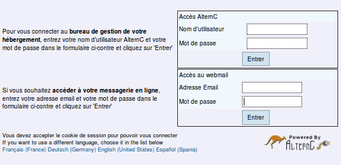

Utiliser le formulaire du haut (celui du bas conduit au webmail, nous
l'expliquerons par la suite).

Le nom d'utilisateur (login) et le mot de passe sont communiqués par
l'administrateur des comptes.

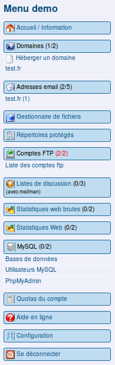

Les fenêtres de gestion d'un compte et d'administration des comptes
sont toutes construites de la manière suivante :

* à gauche le menu,
* à droite un espace dans lequel s'afficheront les actions à accomplir ou accomplies.

Ces fenêtres constituent le « bureau virtuel » que nous allons découvrir
ci-dessous.

La copie d’écran ci-contre présente le menu du bureau virtuel, il s'agit
du menu du compte utilisateur « demo ».

Tous les textes en bleu sont des liens à partir desquels s’afficheront,
dans la partie droite du bureau (coupée ici), les informations
concernant les actions à accomplir ou accomplies.

Nous les découvrirons dans les chapitres suivants.

Les nombres entre parenthèses « Domaines (1/2) » par exemple indiquent
que un nom de domaine est installé sur le compte et que le quota
autorisé sur ce compte est de deux.

Lorsque les nombres sont de couleur rouge « Comptes FTP (2/2) », cela
signifie que le quota est entièrement utilisé.

Le menu « administrateur » comporte une spécificité : une rubrique de
couleur rouge « Administration ».

Les liens sont également de couleur rouge dans cette rubrique (voir
ci-après).

Pour un menu administrateur, la rubrique « Administration » s’intercale
entre les rubriques « Accueil » et « Domaines ».

Elle donne accès à l’administration des comptes hébergés sur le serveur
et à diverses informations concernant le serveur. Son utilisation est
décrite dans le chapitre « Administration des comptes.

### Prise en main

#### Actions

Après authentification, le gestionnaire d’un compte AlternC accède au
bureau virtuel du compte.

Depuis le bureau virtuel de son compte l’utilisateur peut :

* Installer un nom de domaine et gérer des sous-domaines ;
* Créer et gérer des adresses email et des redirections ;
* Créer et gérer des accès FTP (pour le transfert de fichiers sur le
    compte) ;
* Créer et gérer des listes de discussion/diffusion ;
* Télécharger, modifier, déplacer... les fichiers de son site web ;
* Installer, consulter les statistiques de fréquentation de son site
    web ;
* Créer et gérer des accès privés à certaines pages de son site web ;
* Créer et gérer des bases de données liées à son site web.

Il peut également effectuer des opérations de consultation et de
configuration des caractéristiques de son compte et accéder à une aide
en ligne.

#### Utilisation

AlternC offre un panel de possibilités au titulaire et gestionnaire d’un
compte.

* Héberger un nom de domaine qui pointe vers un compte hébergé sur ce
    serveur ou sur un autre serveur...
* Héberger un ou plusieurs sites web, statiques ou dynamiques.
* Utiliser les fonctionnalités, particulièrement riches, du courrier
    électronique : accès sécurisé (SSL), création de son propre SMTP lié
    à un nom de domaine (si son fournisseur d’accès Internet le permet),
    accès par webmail sécurisé (https), configuration de filtres depuis
    le webmail.
* Communiquer par listes de diffusion/discussion... ou tout cela à la
    fois.

Les possibilités d’un compte sont définies par l’« administrateur de
comptes AlternC » qui fixe les quotas en terme d’espace disque et de
nombre de mails, de domaines, de comptes FTP, de bases de données...
(voir chapitre « Administration des comptes »).

L’ensemble des quotas est visible pour le gestionnaire d’un compte
depuis le lien « Afficher les quotas » dans le menu du bureau virtuel.

#### Bureau virtuel

Le bureau se compose de deux espaces :

* Le menu, à gauche, sous le nom du compte.
* La partie droite, qui spécifie, à l’ouverture du compte, la date de
    la dernière connexion ainsi que les services et l’espace utilisés
    par le compte.

Les connexions refusées (mauvais mot de passe par exemple) sont
également mentionnées. Ainsi le gestionnaire d’un compte est informé
d’éventuelles tentatives d’intrusion sur son compte.

Si ce cas se présente sans qu’il y ait eu de fausse manœuvre (erreur de
frappe dans le nom du compte ou le mot de passe) il est conseillé de
contacter l’administrateur du serveur qui consultera les logs (Voir
ci-dessous l’exemple).

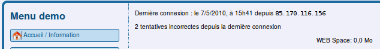

Nous voyons sur ce compte 2 tentatives incorrectes.

#### Configuration

La création d’un compte AlternC requiert un mot de passe et une adresse
mail du gestionnaire du compte. Vous pouvez les modifier depuis la
rubrique Configuration du bureau virtuel.

Il s'agit de l'avant-dernière rubrique du menu.

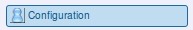

Un clic sur ce menu ouvre trois formulaires :

Pour **changer le mot de passe** utilisez le premier formulaire.\*\*
\*\*

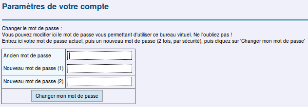
**Attention**,*votre mot de passe initial est requis*.

Si vous l’avez égaré, demandez à l’administrateur des comptes AlternC de
vous en recréer un.

Pour **changer l’adresse email** du gestionnaire du compte utilisez le
second formulaire. Une confirmation sera adressée par mail à l’ancienne
adresse. Nous vous recommandons d’utiliser une adresse mail qui ne soit
pas sur le serveur qui héberge votre compte, ceci afin de pouvoir
communiquer avec vous en cas d’éventuel dysfonctionnement du serveur.

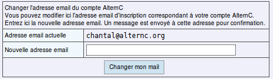

Le troisième formulaire vous propose de choisir **l’affichage de
« bouées » d’aide**. Ces icônes accompagnent les formulaires du bureau
virtuel. Un clic sur celles-ci affiche le chapitre concerné de l'aide en
ligne.

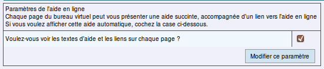

Gestion d'un compte AlternC
---------------------------

### Nom de domaine

Pour être actif, un compte doit être associé à un (ou plusieurs) nom(s)
de domaine ou sous-domaines.

#### Achat du nom de domaine

Un nom de domaine se compose d’un nom suivi d’un point et d’une
extension (fr, com, org, net ...). Chaque nom de domaine est unique au
monde. Il s’acquiert auprès d’un registrar (vendeur de noms de domaine).
Par exemple : alternc.org, octopuce.fr... Pour des domaines dont
l’extension est net, org, com, fr... vous pouvez acheter le domaine chez
un registrar comme Gandi([Gandi](http://gandi.net)) ou BookMyName
([bookmyname.com](http://bookmyname.com)) par exemple.
Lorsque vous achetez un domaine, indiquez immédiatement les DNS (adresses)
du serveur qui gère les DNS.

Cette information vous sera fournie par votre hébergeur.

Il faut acheter le nom de domaine avant de l’installer, sauf pour les
noms de domaine en .fr ou .eu, où il faut installer le domaine avant de
l’acheter. Une vérification automatique est faite lorsqu’un domaine est
installé. Si des DNS corrects ne sont pas enregistrés dans la base
mondiale des noms de domaines, le serveur refusera l’installation, sauf
si l’administrateur des comptes AlternC en a donné l’autorisation et
vous l’a indiqué : voir chapitre « Administration des comptes ».

Mais, pour que le monde entier puisse consulter les pages web vers
lesquelles pointe le nom de domaine il faut attendre que les
fournisseurs d’accès Internet aient bien enregistré l’information afin
de diriger leurs usagers vers le bon serveur (compter entre 24 et 72
heures).

#####

####

#### Installation d’un nom de domaine sur un compte AlternC

L’accès au formulaire d’installation se fait par un clic dans la
rubrique « Domaines » sur le lien « Héberger un domaine ». Dans la
partie droite du bureau virtuel, le formulaire s’affiche.

##### 

##### Installer un premier nom de domaine sur le compte

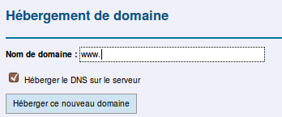

Inscrire le nom de domaine souhaité, là où se positionne le curseur de
la souris, à la suite de « www. ». Par défaut la case « Héberger le DNS
sur le serveur » est cochée. Cela est tout à fait normal : le cas où
vous hébergez un site ou des adresses email d'un domaine sans pour
autant en héberger les DNS est assez rare et ne concerne que les
utilisateurs avancés.

L'installation du nom de domaine créera automatiquement un répertoire du
même nom mais sans tiret et point, par exemple l'installation du nom de
domaine « aide-alternc.org » créera le répertoire « aidealterncorg ».

**Le chapitre suivant aborde en détail ce qui concerne les répertoires et
fichiers**.

### **Problème éventuel**

Si vous obtenez cette réponse après avoir cliqué sur le bouton
« Héberger ce nouveau domaine »,

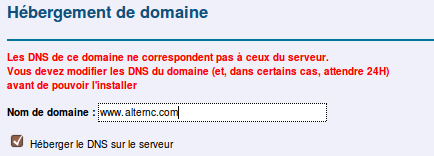

cela signifie que le nom de domaine (ici alternc.com) n'est pas
enregistré comme hébergé sur ce serveur. Le serveur ne l’installera pas.

######

#####

Plusieurs cas de figure :

* le nom de domaine ne vous appartient pas, vous n'avez aucunement le
    droit de l'installer
* vous avez acheté votre nom de domaine il y a moins de 48 heures (il
    faut attendre encore quelques heures)
* les DNS sont mal renseignées auprès du registrar (celui qui a vendu
    le nom de domaine), contactez l'administrateur du serveur pour qu'il
    vous indique les bons DNS.

Une indication se situe au bas de cette page en affichant les DNS
réelles du nom de domaine

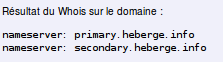

Le serveur a consulté la « banque des domaines existants » et affiche le
résultat. Si les DNS ne sont pas ceux indiqués par l’administrateur du
serveur, vous êtes soit dans le 1er soit dans le 3ème cas.

-------------------------------------------------------------------------

######

######

######

-------------------------------------------------------------------------

######

######

##### Installer un autre nom de domaine sur le compte

Il est possible d'installer plusieurs noms de domaine sur un
compte AlternC.

L'installation d'un second nom de domaine (et des suivants)
sur le compte propose une alternative

1.  Associer ce nom de domaine à ses propres pages web et
    donc l'installer sur un répertoire qui lui sera spécifique. C'est le
    choix proposé par défaut. L'installation de ce domaine créera comme
    pour le premier un nouveau répertoire, ici « aidealterncnet ».

    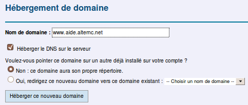

2.  Associer ce nom de domaine à un autre nom de domaine
    installé sur le compte et donc aux pages web affichées par cet autre
    nom de domaine (cas typique d'un nom décliné en plusieurs domaines :
    toto.net, toto.info, toto.com...) Dans ce cas, l'installation du nom
    de domaine ne crée pas de nouveau répertoire.

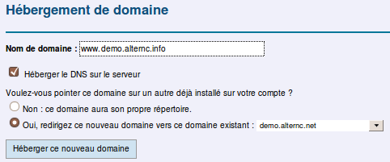

------------------------------------------------------------------------

######

######

Que vous installiez le premier nom de domaine ou les
suivants sur un compte AlternC, un clic sur le bouton « Héberger ce
nouveau domaine » affiche soit un message d'erreur (voir ci-dessus 
« Problème éventuel ») soit l'information suivante :

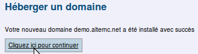

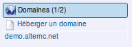

Le bouton \[Cliquer ici pour continuer\] affiche le nouveau 
menu du bureau : le nom de domaine demo.alternc.net est inscrit
dans la rubrique « Domaines ».

Il faut toutefois attendre environ 5 minutes pour qu’il soit
bien pris en compte par le serveur, puis environ 1 heure pour qu’il soit
pris en compte par les machines qui gère les DNS du serveur.

La procédure serait exactement la même pour un nom de domaine dont
l’extension serait org, net, com, info ...

**Attention **: certains noms de domaine doivent être installés sur le
serveur AVANT leur achat. C’est la cas des noms de domaine en .fr car
l’AFNIC (organisme qui gère ces noms) vérifie que le serveur est
conforme à ce qui est demandé pour l’hébergement de ce type de nom de
domaine. N'hésitez pas à demander des informations à ce propos à
l'administrateur du serveur, si nécessaire.

Nous allons maintenant décrire les paramètres de ce nom de domaine sur
le serveur.

Pour cela il suffit de cliquer sur le lien « demo.alternc.net » dans la rubrique « Domaines » du menu.

#### Paramètres du domaine installé sur le serveur

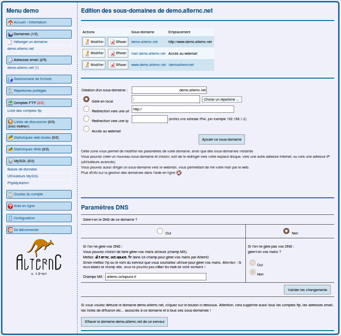
\*\*\*\*\*\*Un clic sur le nom de domaine affiche plusieurs zones dans
la partie gauche du bureau virtuel :\*\*\*\*\*\*

------------------------------------------------------------------------

Dans ce premier temps, nous nous limiterons à les décrire.

#####

##### Les sous-domaines

L’URL : « demo.alternc.net » est redirigée vers « www.demo.alternc.net »

il existe un sous-domaine « mail.demo.alternc.net » qui donne accès au
webmail.

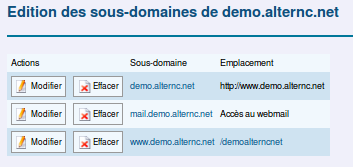

L'URL « www.demo.alternc.net » est dirigée vers le répertoire « demoalterncnet » que nous avons évoqué ci-dessus, ce répertoire qui
est à la racine du compte « / », cette barre oblique représente la racine.

Pour une gestion des domaines et sous-domaines (Actions « Modifier » et « Effacer ») reportez-vous au chapitre « Gestion de domaine et 
sous-domaine ».

Il en est de même pour cette zone qui concerne la création de nouveaux 
sous-domaines

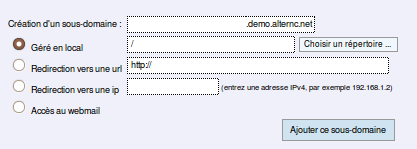

##### 

##### Zone Paramètres DNS

**Attention** : ne jamais modifier ces paramètres sans l'avis de l'administrateur du serveur.

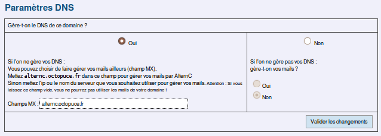

##### Supprimer un nom de domaine

**Attention** : tout clic sur ce bouton (placé au bas de la page)
vous proposera la suppression du domaine concerné, ici, comme indiqué en 
haut de page, il s'agit du domaine « demo.alternc.net ».

Si vous confirmez cette action, la suppression du domaine entrainera la suppression de ses sous-domaines et de toutes les adresses email, listes
de diffusion, statistiques et associées à ce domaine ( bien évidemment
tous les messages des adresses email concernées !).

Ce bouton est donc à manipuler avec une extrême précaution.

**Remarque** : Il se peut que la zone « Paramètres DNS » et le bouton
de suppression du domaine ne s'affichent pas. C'est que l'administrateur
des comptes AlternC a jugé utile de ne pas les faire apparaître pour ce
nom de domaine. Si cela vous pose un problème, contactez-le.

Nous allons poursuivre notre découverte de la gestion d'un compte AlternC
par un voyage dans le gestionnaire de fichiers, au cœur de l'hébergement
de vos données.

### Répertoires et fichiers

Le gestionnaire de fichiers est l’élément central pour la gestion d’un
site web. Il est accessible depuis le lien « Gestionnaire de fichiers »
du menu.

#### Description du gestionnaire de fichiers

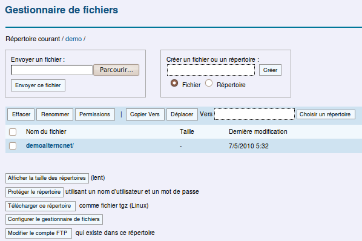
Ici nous utiliserons des copies d’écran issues soit du compte demo, soit
du compte aideac en sachant que l’aide est valable quelque soit le
compte concerné.

Dans la partie droite de la copie d’écran nous distinguons cinq zones.

1 – En haut à gauche une zone informative « Répertoire courant »
    demo/ : nous sommes à la racine du compte demo, racine symbolisée
    par la barre oblique (/)

2 – Au dessous

* à gauche un **formulaire de téléchargement** (upload) de fichier
    depuis le disque dur de l’ordinateur du gestionnaire du compte
* à droite un **formulaire de création de fichier ou répertoire**.

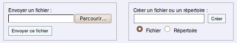

Au centre un espace se décline en deux zones :

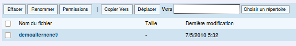

3 – Une zone de **manipulation des fichiers** présents sur le compte

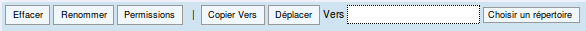

4 – Une zone qui affiche la **liste des répertoires et fichiers**
    présents sur le compte.

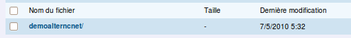

5 – En bas une zone de boutons

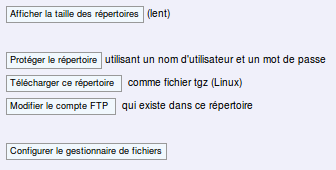

####

#### Envoi d'un fichier

Dans notre exemple, la liste des répertoires affiche uniquement le
répertoire « demoalterncnet », répertoire créé à l'installation du nom
de domaine « demo.alternc.net ».

Nous savons qu'il s'agit d'un répertoire car il est inscrit en
caractères gras et suivi d'une barre oblique /.

Pour entrer dans ce répertoire il suffit de cliquer sur son nom

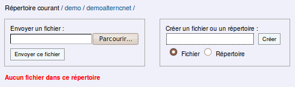
Ce répertoire est vide, comme indiqué en caractères rouges. Remarquons,
au-dessus des formulaires, la zone « Répertoire courant » qui affiche le
chemin.

Nous allons envoyer un fichier dans le répertoire « demoalterncnet ».
Pour cela, utiliser le formulaire de gauche.

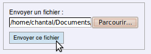
Choisir le fichier à envoyer à l’aide du bouton \[Parcourir\], puis
cliquer sur le bouton \[Envoyer un fichier\].

L'affichage est modifié : la liste ci-dessous affiche le fichier, sa
taille, la date de son envoi et un lien « Voir » que nous allons tester.

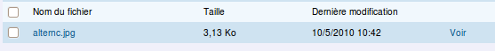
Le fichier envoyé est une image « alternc.jpg », c'est le logo AlternC.
Il pèse 3,13 Ko et a été envoyé sur le serveur, très précisément le 10 mai
2010 à 10h42 (ici le serveur est à l'heure de Paris).

Un clic sur ce lien « Voir » affiche, dans le navigateur, la page
ci-dessous

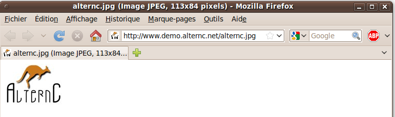
#### Création d’un répertoire, d’un fichier

##### Création d'un répertoire

Toujours positionné dans le répertoire « demoalterncnet », sélectionner
« Répertoire » dans le formulaire de droite et inscrire le nom du
répertoire dans la zone texte (ici « site ») et cliquer sur \[Créer\].

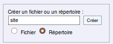
Le répertoire apparaît dans la liste, avec la date et l’heure de création.
Il est inscrit en gras et son nom suivi d’une barre oblique (cela montre
qu'il s'agit d'un répertoire).

Contrairement au fichier « alternc.jpg » il n’est pas suivi du lien
« Voir ». Ce lien, « Voir » permet de visualiser dans le navigateur la
page composée par le code du fichier.

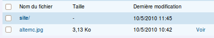
##### Création d'un fichier

Nous allons créer un nouveau fichier dans le répertoire « site ». Nous
le nommerons « index.html » (bien sélectionner « Fichier » avant de le
créer et ne pas oublier l’extension, essentielle pour les fichiers).

1.  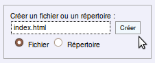
	Se positionner dans le répertoire site (clic sur « site »)
2.  Utiliser le formulaire de droite
3.  Créer le fichier

Nous allons maintenant éditer ce fichier, pour cela il suffit de cliquer
sur son nom « index.html ».

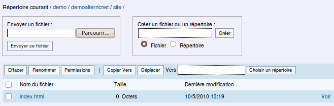
Dans la zone texte inscrivons une phrase (attention, il ne s’agit pas
ici de code correct).

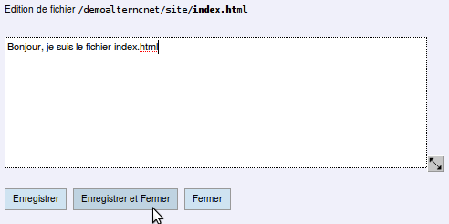
**Remarque **: La zone de texte peut être ajustée en largeur et hauteur.
Pour cela il suffit de tirer la double flèche noire, en bas à droite de
la zone, en maintenant la touche Maj du clavier enfoncée.

Puis, cliquons sur le bouton \[Enregistrer et Fermer\] pour retourner
dans le gestionnaire de fichiers (le bouton \[Enregistrer\] a pour effet
d’enregistrer le fichier en le laissant ouvert, le bouton \[Fermer\]
renvoie au gestionnaire de fichiers sans enregistrer le fichier).

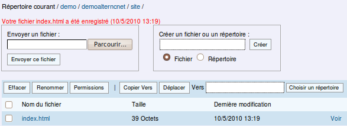
La zone informative, en haut du gestionnaire de fichiers, indique que
nous sommes dans le répertoire site, puis que le fichier a bien été
enregistré (date et heure), le poids du fichier est passé de 0 à 38
octets.

Nous allons maintenant le visualiser dans le navigateur. Avec le
navigateur Firefox, un clic droit de souris sur le lien « Voir » qui
suit le fichier « index.html » permet d’ouvrir le lien dans un nouvel
onglet.

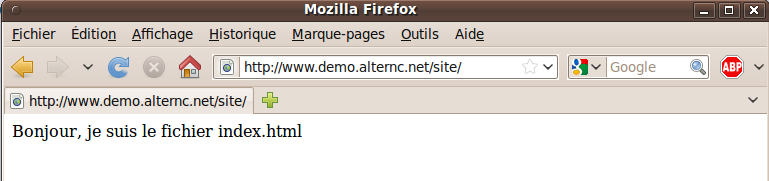
Si vous n’utilisez pas un navigateur qui permet ce choix, vous pouvez
ouvrir une autre fenêtre qui vous affichera l’adresse :
http://demo.alternc.net/site/index.html

Remarquons que le fait d’indiquer l’URL
http://aide-alternc.org/index.html dans le navigateur affiche
automatiquement http://www.demo.alternc.net/site/index.html (le nom de
domaine sans les www est dirigé vers le nom de domaine avec les www
:voir le chapitre « Paramétres du domaine installé sur le serveur »

Soyons curieux : que se passe-t-il si nous inscrivons l’URL
http://www.demo.alternc.net dans la fenêtre d’un navigateur ?

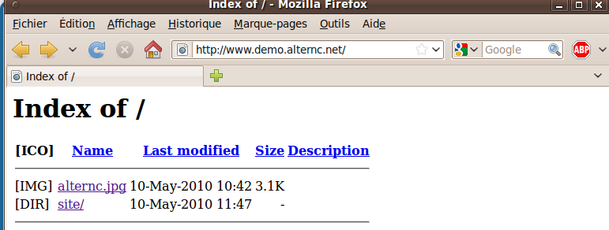
Aucun fichier index n’étant trouvé à la racine du compte, le navigateur
affiche la liste des répertoires présents et autres fichiers (ici le
fichier «alternc.jpg» et le répertoire « site ». Nous allons remédier à
ceci en déplaçant le fichier « index.html » que nous avons créé du
répertoire « site » au répertoire « demoalterncnet ».

#### Manipuler fichiers et répertoires

##### Déplacer un fichier

Se positionner dans le répertoire « site »

1.  Cocher la case à gauche du nom du fichier « index.html »
2.  Cliquer sur le bouton \[Choisir un répertoire\] comme indiqué dans
    la copie d'écran ci-dessous

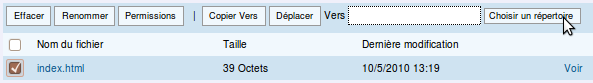

Cette action ouvre une petite fenêtre Cliquer sur le nom du répertoire
« demoalterncnet », puis valider le choix avec le bouton
\[Sélectionner\].

La fenêtre se ferme.

Le nom du répertoire apparaît dans la zone de manipulation des fichiers.

1.  Cliquer sur le bouton \[Déplacer\] de cette zone.

Le fichier s’affiche désormais dans le répertoire « site », pour le
trouver il suffit de cliquer sur le nom de ce répertoire dans la zone
« Répertoire courant » en haut de page.

Si nous ouvrons ce fichier dans un navigateur (lien « Voir »), l’adresse
dans la barre d’URL est devenue :
<http://www.demo.alternc.net/index.html>. Pour déplacer un répertoire on
peut procéder de la même manière.

**Attention **: *toujours bien vérifier le résultat d'un déplacement.*

Nous allons étudier l'ensemble des fonctionnalités de la zone de
manipulation de fichiers et répertoires.

##### Effacer un fichier ou un répertoire

Cocher la case qui précède le nom du fichier ou du répertoire

Cliquer sur le bouton \[Effacer\]

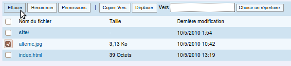

\*\*\*\*\*\*Une confirmation est demandée\*\*\*\*\*\*

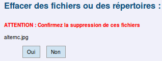

\*\*\*\*\*\*La demande de confirmation affiche le nom du ou des fichiers
/ répertoires.\*\*\*\*\*\*

##### \*\*\*\*\*\*Renommer un fichier ou un répertoire \*\*\*\*\*\*

Cocher la case qui précède le nom du fichier ou du répertoire

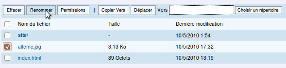
\*\*\*\*\*\*Cliquer sur le bouton \[Renommer\]\*\*\*\*\*\*

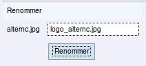

------------------------------------------------------------------------

\*\*\*\*\*\*Un petit formulaire
s\*\*\*\*\*\*\*\*\*\*’\*\*\*\*\*\*\*\*\*\*affiche au-dessus de la zone
de manipulation des fichiers et répertoires.\*\*\*\*\*\*

------------------------------------------------------------------------

\*\*\*\*\*\*Attention : conservez toujours
l\*\*\*\*\*\*\*\*\*\*’\*\*\*\*\*\*\*\*\*\*extension du fichier (ici
.jpg), évitez les espaces et bannissez les caractères accentués du
nom.\*\*\*\*\*\*

##### Gérer les permissions d'un fichier où d'un répertoire

\*\*\*\*\*\*Il peut être souhaitable de changer les permissions
(lecture, écriture) d\*\*\*\*\*\*\*\*\*\*‘\*\*\*\*\*\*\*\*\*\*un fichier
ou de l\*\*\*\*\*\*\*\*\*\*’\*\*\*\*\*\*\*\*\*\*ensemble des fichiers
d\*\*\*\*\*\*\*\*\*\*‘\*\*\*\*\*\*\*\*\*\*un répertoire. Bien que vous
puissiez effectuer cette opération par un client FTP, cette
fonctionnalité intégrée dans le gestionnaire de fichiers
\*\*\*\*\*\*\*\*\*\*d\*\*\*\*\*\*\*\*\*\*’\*\*\*\*\*\*\*\*\*\*AlternC
s\*\*\*\*\*\*\*\*\*\*’\*\*\*\*\*\*\*\*\*\*avère souvent
utile.\*\*\*\*\*\*

Cocher la case qui précède le nom du fichier ou du répertoire

\*\*\*\*\*\*Cliquer sur le bouton \[Renommer\]\*\*\*\*\*\*

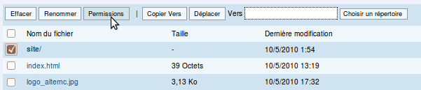

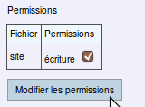
\*\*\*\*\*\*Un petit formulaire s\*\*\*\*\*\*\*\*\*\*’\*\*\*\*\*\*\*\*\*\*affiche
au-dessus de la zone de manipulation des fichiers et
répertoires.\*\*\*\*\*\*

\*\*\*\*\*\*Vous pouvez choisir de cocher (choix par défaut) la case
« écriture » ou de la décochez en limitant le fichier ou tous les
fichiers d\*\*\*\*\*\*\*\*\*\*’\*\*\*\*\*\*\*\*\*\*un répertoire à la
lecture.\*\*\*\*\*\*

##### Copier un fichier ou un répertoire vers un autre répertoire\*\*\*\*\*\* \*\*\*\*\*\*

------------------------------------------------------------------------

Se positionner dans le répertoire qui contient le fichier à copier, ici
« demoalterncnet »

1.  Cocher la case à gauche du nom du fichier, ici « logo\_alternc.jpg »
2.  \*\*\*\*\*\*Cliquer sur le bouton \[Choisir un répertoire\] comme
    pour le déplacement de fichier\*\*\*\*\*\*
3.  \*\*\*\*\*\*Sélectionner le répertoire souhaité (ici « site ») dans
    la \*\*\*\*\*\*\*\*\*\*petite fenêtre\*\*\*\*\*\*
4.  \*\*\*\*\*\*Cliquer sur le bouton \[Copier vers\] comme indiqué sur
    la copie d'écran ci-dessous.\*\*\*\*\*\*

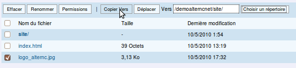

\*\*\*\*\*\*Le fichier « logo\_alternc.org » est maintenant présent dans
les \*\*\*\*\*\*\*\*\*\*deux répertoires « demoalterncnet » et
« site ».\*\*\*\*\*\*

\*\*\*\*\*\*Pour anticiper sur la démonstration suivante, nous allons de
la même manière copier le fichier « index.html » dans le répertoire
« site ».\*\*\*\*\*\*

\*\*\*\*\*\*Sur un compte AlternC vous pouvez installer un ou plusieurs
sites ou outils web.\*\*\*\*\*\*

\*\*\*\*\*\*Imaginons que le répertoire « site » contienne également un
outil web de type porte-documents ou agenda en ligne.\*\*\*\*\*\*

\*\*\*\*\*\*Il est plus pratique
d\*\*\*\*\*\*\*\*\*\*‘\*\*\*\*\*\*\*\*\*\*utiliser un nom de domaine ou
de sous-domaine qu\*\*\*\*\*\*\*\*\*\*’\*\*\*\*\*\*\*\*\*\*une URL
complexe.\*\*\*\*\*\*

\*\*\*\*\*\*Par exemple
\*\*\*\*\*\*[\*\*\*\*\*\*http://agenda.demo.alternc.org\*\*\*\*\*\*](http://agenda.demo.alternc.org/)\*\*\*\*\*\*
plutôt que
\*\*\*\*\*\*[\*\*\*\*\*\*http://demo.alternc.org/site/agenda/\*\*\*\*\*\*](http://demo.alternc.org/site/agenda/)

\*\*\*\*\*\*Nous allons donc voir comment modifier le chemin
d\*\*\*\*\*\*\*\*\*\*‘\*\*\*\*\*\*\*\*\*\*un domaine ou
d\*\*\*\*\*\*\*\*\*\*’\*\*\*\*\*\*\*\*\*\*un
sous-\*\*\*\*\*\*\*\*\*\*domaine.\*\*\*\*\*\*

##### Décompresser un fichier

\*\*\*\*\*\*Une fonctionnalité particulièrement appréciée par les
personnes qui souhaitent faire des installations rapides de tel ou tel
outil collaboratif par exemple : la décompression de fichier depuis le
gestionnaire.\*\*\*\*\*\*

\*\*\*\*\*\*Exemple : \*\*\*\*\*\*

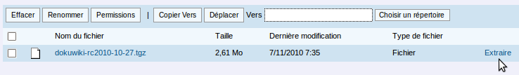
\*\*\*\*\*\*Ici nous avons téléchargé DokuWiki sous sa forme compressée, soit
2,61 Mo. Un clic sur le lien « Extraire » décompresse le fichier.\*\*\*\*\*\*

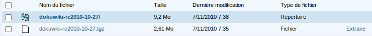

\*\*\*\*\*\*Nous avons maintenant le répertoire
\*\*\*\*\*\*dokuwiki-rc2010-10-27/ qui pèse 9;2Mo, répertoire à partir
duquel nous allons installer l'application. Nous pouvons supprimer le
fichier compressé.

#### 

#### Autres actions depuis le gestionnaire de fichiers

\*\*\*\*\*\*Un ensemble de boutons constitue la dernière zone du
gestionnaire de fichiers\*\*\*\*\*\*

##### 

##### Afficher la taille des répertoires

\*\*\*\*\*\*Le premier bouton \[Afficher la taille des répertoires\]
agit sur l\*\*\*\*\*\*\*\*\*\*’\*\*\*\*\*\*\*\*\*\*affichage des
répertoires.\*\*\*\*\*\*

\*\*\*\*\*\*Par défaut seule la taille des fichiers est indiquée (elle
est \*\*\*\*\*\*\*\*\*\*immuable tant que le fichier
n\*\*\*\*\*\*\*\*\*\*’\*\*\*\*\*\*\*\*\*\*est pas modifié).\*\*\*\*\*\*

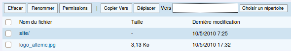

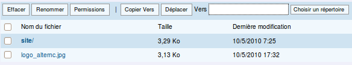
\*\*\*\*\*\*Par contre la taille des répertoires varie en fonction du 
contenu ce qui signifie un calcul systématique de la taille au moment de
l\*\*\*\*\*\*\*\*\*\*‘\*\*\*\*\*\*\*\*\*\*affichage, opération qui peut
\*\*\*\*\*\*\*\*\*\*s\*\*\*\*\*\*\*\*\*\*’\*\*\*\*\*\*\*\*\*\*avérer un
peu lente comme indiqué à la suite du bouton.\*\*\*\*\*\*

##### \*\*\*\*\*\*

##### 

##### Protéger le répertoire

Le second bouton \[Protéger le répertoire\] permet d’interdire la
consultation publique du répertoire courant en la limitant à des
visiteurs privilégiés. AlternC génère automatiquement les fichiers de
protection nécessaires (« .htaccess » et « .htpasswd »).

Cette action peut être conduite depuis le gestionnaire de fichiers sur
le répertoire courant ou depuis le menu du bureau virtuel. Elle est
présentée dans le chapitre « Protéger un répertoire ».

##### Télécharger ce répertoire

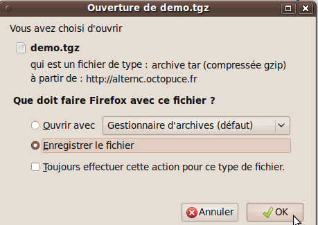
Cette action permet d’enregistrer sur votre ordinateur l’ensemble des
répertoires et fichiers du répertoire courant.

Plusieurs formats sont disponible, le choix se fait depuis la
configuration du gestionnaire de fichiers.

Il est présenté dans le chapitre « Configurer le gestionnaire de
fichiers.

##### Créer/Modifier le compte FTP

\*\*\*\*\*\*Il s\*\*\*\*\*\*\*\*\*\*‘\*\*\*\*\*\*\*\*\*\*agit ici de
créer ou de modifier un compte FTP sur le répertoire courant.
\*\*\*\*\*\*\*\*\*\*Voir
l\*\*\*\*\*\*\*\*\*\*’\*\*\*\*\*\*\*\*\*\*explication dans le chapitre
« Transfert de fichiers et FTP ».\*\*\*\*\*\*

##### \*\*\*\*\*\*

##### \*\*\*\*Configurer le gestionnaire de fichiers\*\*\*\*

Le quatrième bouton « Configurer le gestionnaire de fichiers » est en
soi explicite. Il s’agit d’adapter les fonctionnalités du gestionnaire
de fichiers à sa convenance. Cliquer sur le bouton \[Configurer le
gestionnaire de fichiers\]

\*\*\*\*\*\*Dans la partie droite du bureau un tableau
s’affiche :\*\*\*\*\*\*

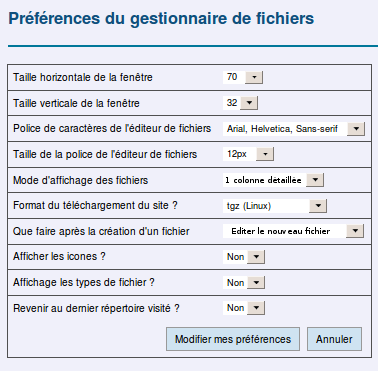
Les deux premières lignes du tableau permettent d’indiquer la **taille
de la fenêtre** d’éditions de fichiers par défaut *(L’éditeur de fichier
est la fenêtre qui permet d’afficher le code d’un fichier)*.

Les deux lignes suivantes concernent la **police** de la fenêtre
d’édition des fichiers. Le type et la **taille** de la police de
caractère dépend des préférences de chacun. Sélectionner les valeurs
souhaitées en utilisant les menus déroulants.

Le **mode d’affichage des fichiers** propose : une colonne détaillée
(mode actuel), deux colonnes ou trois colonnes. Lorsque les fichiers
sont peu nombreux le premier choix convient.

Le **téléchargement** (enregistrement sur votre ordinateur) de
l’ensemble des fichiers d’un répertoire peut s’effectuer en 4 formats
différents : tgz et tar.bz2 (Linux) zip (Windows) et tar.Z (Unix).

**Après la création d'un fichier** depuis le gestionnaire de fichiers
(ce que nous avons fait précédemment avec le fichier « index.html »)
deux choix sont possibles : Afficher à nouveau le gestionnaire de
fichiers ou Éditer le fichier nouvellement créé.

Nous allons ici, pour l’exemple, sélectionner l’**affichage des icônes
et des types de fichiers**. De même nous allons choisir de **revenir au
dernier répertoire visité** pour l’affichage du gestionnaire de
fichiers.

Cliquer sur le bouton \[Modifier mes préférences\] pour enregistrer la
configuration.

Ouvrons le répertoire « site » dans le gestionnaire de fichiers. Des
icônes précèdent le nom des fichiers et leur type est indiqué.

### Gérer les domaines et sous-domaines

**Depuis le bureau virtuel AlternC il est aisé de diriger un
domaine ou un sous-domaine vers le répertoire de son choix.**

------------------------------------------------------------------------

#### Modifier le chemin d'un domaine

**Pour la démonstration nous allons rediriger le domaine
« demo.alternc.net » vers le répertoire « site ».**

**Dans le menu du bureau virtuel, cliquer sur le lien
« demo.alternc.net » dans la rubrique « Domaines ». Nous allons utiliser
la zone des sous-domaines.**

\**Nous avons noté que « demo.alternc.net » est redirigé vers
le sous-domaine « www.Demo.alternc.net ». Nous allons donc modifier
l'emplacement de « www.demo.alternc.net ».\**

* \**Cliquer sur le bouton \[modifier\] qui se trouve sur la
    ligne de « www. demo.alternc.net ».\**

    

* Conserver la sélection du bouton radio sur « Géré en
    local » 
-	Cliquer sur le bouton \[Choisir un répertoire\]

\**Comme pour le déplacement de fichier, sélectionner le
répertoire voulu dans la petite fenêtre qui s’ouvre.\**

------------------------------------------------------------------------

------------------------------------------------------------------------

------------------------------------------------------------------------

* \*\*\*\*\*\*Le chemin est modifié dans la zone de texte\*\*\*\*\*\*
   
-	\**Cliquer sur le bouton \[Valider les changements\]\**

\**Voici le résultat obtenu\**

\*\*\*\*\*\*Un petit programme se déclenche à intervalle régulier sur le
serveur pour enregistrer ce type de modification. Ici, il se déclenchera
dans 4 minutes.\*\*\*\*\*\*

\*\*\*\*Attention \*\*\*\*\*\*\*\*:\*\*\*\*\*\*\*\*\* le bouton
\*\*\*\*\*\*\*\*\*\[Effacer\]\*\*\*\*\*\*\*\*\* supprime le domaine ou
sous-domaine... à manipuler avec précaution !\*\*\*\*\*

En inscrivant l’URL http://www.demo.alternc.net dans une fenêtre de
navigateur, nous ouvrons maintenant, directement le fichier
« index.html » du répertoire « site ». Il en est de même pour l’URL
http://demo.alternc.net, puisqu’elle renvoie vers
http://www.demo.alternc.net.

\*\*\*\*\*\*Poursuivons nos manipulations en installant un
sous-domaine.\*\*\*\*\*\*

\*\*\*\*\*\*Pour la démonstration nous allons créer un répertoire
« agenda » dans le répertoire « site » et un fichier « index.html » dans
le répertoire « agenda ».\*\*\*\*\*\*

------------------------------------------------------------------------

#### Création d’un sous-domaine

Nous allons installer un sous-domaine sur le compte « demo » et faire
pointer ce sous-domaine vers un répertoire créé pour l’occasion.

\*\*\*\*\*\*Pour la démonstration créer un répertoire « agenda » dans le
répertoire « site » et un fichier « index.html » dans le répertoire
« agenda ».\*\*\*\*\*\*

\*\*\*\*\*\*Dans le menu du bureau virtuel, cliquer sur le lien
« demo.alternc.net » dans la rubrique « Domaines ». Nous allons utiliser
la zone des sous-domaines.\*\*\*\*\*\*

* 
	\*\*\*\*\*\*Inscrire le nom souhaité à l'emplacement du curseur de .
	la souris, avant le « demo.alternc.net »\*\*\*\*\*\*
* \*\*\*\*\*\*Cliquer sur le bouton \[Choisir un répertoire\]\*\*\*\*\*\*
* \*\*\*\*\*\*Sélectionner le \*\*\*\*\*\*\*\*\*\*répertoire
    « agenda »\*\*\*\*\*\*

------------------------------------------------------------------------

------------------------------------------------------------------------

------------------------------------------------------------------------

------------------------------------------------------------------------

* \*\*\*\*\*\*Pour valider nos actions cliquer sur le bouton \[Ajouter
    ce sous-domaine\]\*\*\*\*\*\*

\*\*\*\*\*\*Le sous-domaine « agenda.demo.alternc.net » apparaît dans la
liste des domaines et sous-domaines. Il pointe bien vers le répertoire
« agenda ».\*\*\*\*\*\*

Nous allons mettre à profit les quelques minutes d’attente, avant la
prise en compte de ce sous-domaine, pour modifier le fichier
«  index.html  » dans le répertoire « agenda ».

Dans le menu (partie gauche du bureau virtuel), cliquer sur la rubrique
« Gestionnaire de fichiers » puis dans la liste des répertoires et
fichiers naviguer jusqu'au répertoire « agenda » et éditer le fichier
« index.html », simplement en cliquant sur son nom.

Inscrire le code voulu (ici du HTML très basique)

Puis cliquer sur le bouton \[Enregistrer et fermer\].

Vérification : si l’opération nous a pris plusieurs minutes il y a de
grandes chances que le sous-domaine « agenda.demo.alternc.net » soit
pris en compte sur le serveur. Pour le vérifier, ouvrir un nouvel onglet
ou une fenêtre du navigateur et inscrire l’URL :

http://agenda.demo.alternc.net (attention sans les www !)

#### Autres possibilités

Dans les formulaires d'édition d'un domaine ou de création
d'un sous-domaine, nous avons utilisé uniquement la gestion en local.
C'est à dire que l'emplacement vers lequel pointe le domaine ou
sous-domaine se trouve sur notre compte AlternC.

Il est possible de créer un domaine ou un sous-domaine qui
renvoie vers :

* un autre domaine ou sous-domaine
* un site hébergé sur un autre serveur

ou encore de créer un nouveau-sous domaine ou domaine pour
l'accès au webmail.

### Transfert de fichiers et FTP

Nous avons vu dans le chapitre « Répertoires et fichiers /
Envoi d'un fichier » qu'il était possible d'envoyer un fichier dans un
répertoire directement depuis le gestionnaire de fichiers.

Toutefois, l'envoi de répertoires contenant de nombreux
fichiers nécessite l'utilisation d'un outil FTP.

#### Les comptes FTP

Dans le menu du bureau virtuel la rubrique « Comptes FTP » propose deux
liens : « Créer un compte ftp » et « Liste des comptes ftp ».

Dans un premier temps nous allons cliquer sur le lien « **Liste des
comptes ftp** ».

À la création d’un compte AlternC, un compte FTP est 
automatiquement créé à la racine du compte
(rappel : le / signifie la racine du compte), avec les mêmes nom et 
mot de passe que celui-ci. Il donne accès, en lecture et écriture, à tous
les répertoires, sous-répertoires et fichiers du compte AlternC.

Ce compte FTP apparaît ici précédé d'une case à cocher (pour
sa suppression) et d'un bouton \[Modifier\].

Attention : modifier le mot de passe peut être utile pour donner accès
aux fichiers du compte par un client FTP classique, sans donner accès
à la gestion du compte (noms de domaines, adresses mail...).

##### 

##### Modifier un compte FTP

Un clic sur le bouton \[Modifier\] affiche le formulaire ci-dessous.

Depuis ce formulaire il est possible

* de modifier le nom d'utilisateur du compte FTP
* de modifier le répertoire concerné par ce compte FTP
* de modifier le mot de passe du compte FTP

soit une ou l'autre de ces actions soit toutes.

##### Créer un compte FTP

Le formulaire est similaire à celui qui permet la modification d'un
compte FTP.

Tout nom de compte FTP comporte obligatoirement soit le nom du compte
AlternC, soit le nom de domaine installé sur ce compte (choisir depuis
le menu déroulant), il peut être complété par un autre nom (caractères
non accentués) à inscrire dans la zone texte qui suit le « \_ ».

Le choix du répertoire s'effectue, comme nous l'avons déjà vu pour la
gestion d'autres fonctionnalités, par un clic sur le bouton \[Choisir un
répertoire\].

Un clic sur le bouton \[Créer le compte FTP\] affiche la liste des
comptes augmentés du nouveau compte.

Pour utiliser un de ces comptes FTP : entrez les paramètres suivant dans
votre client FTP (par exemple Filezilla) :

* Hôte : le nom du serveur ou votre nom de domaine (ici
    « demo.alternc.org »)

* Utilisateur : votre nom de compte ftp (le nom du compte alternc (ici
    «demo» ou « demo.alternc.org\_toto », selon que vous voulez accéder
    à l’ensemble des répertoires ou seulement au répertoire « site »)

* Mot de passe : le mot de passe que vous avez entré (à ne pas oublier
    donc !). Si vous oubliez votre mot de passe, vous pouvez le modifier
    en allant dans le bureau AlternC. En effet, vous ne retrouverez pas
    votre mot de passe car il est stocké chiffré sur le serveur. Vous
    pourrez seulement le modifier.

Il est possible de créer plusieurs comptes FTP pour un même répertoire.

### Protéger un répertoire

Vous souhaitez peut-être interdire la consultation publique de répertoires d’un site en la limitant à des visiteurs privilégiés. Ce peut-être un album
de photos, des pages réservées aux adhérents d’une association... 
AlternC génère automatiquement les fichiers de protection nécessaires 
(« .htaccess » et « .htpasswd »)

#### Protéger un répertoire depuis le menu du bureau virtuel

Un clic sur la rubrique « Répertoires protégés » du menu
affiche les informations ci-contre

------------------------------------------------------------------------

Cliquer sur le bouton \[Protéger un répertoire\]

Pour choisir le répertoire utiliser le bouton
\[Choisir un répertoire\]comme nous l'avons fait précédemment.

------------------------------------------------------------------------

Cliquer sur le bouton \[Protéger ce répertoire\]

Le répertoire « agenda » est protégé, mais, pour le moment
personne n'a le droit d'y accéder.

Il faut donc créer des utilisateurs qui auront ces droits.

Mais avant cela nous allons ouvrir le gestionnaire de
fichiers et naviguer jusqu'au répertoire « agenda » où 
deux nouveaux fichiers « .htaccess » et « .htpasswd » 
ont été générés.

Le fichier « .htpasswd » ne contient aucune donnée (0 octet), vérifier
en l’éditant : il est vide. Aucun utilisateur n’est autorisé à
visualiser les fichiers du répertoire.

Retournons dans la rubrique « Répertoires protégés » puis cliquons sur
le bouton \[Gérer les utilisateurs et mots de passe\]

Après avoir renseigné le formulaire cliquer sur le bouton \[Ajouter
l'utilisateur\]

L'utilisateur « toto » a été ajouté ».

La case à cocher sert à supprimer l’utilisateur.

Il est possible de modifier le mot de passe depuis le bouton \[Changer le
mot de passe de cet utilisateur\]

Pour vérification cliquons sur le bouton \[Afficher le contenu de ce
répertoire dans le Gestionnaire de Fichiers ».

Le fichier « .htpassword » a été complété, il pèse
maintenant 41 octets.

Éditons ce fichier :

Le nom de l'utilisateur est affiché en clair, le mot de passe est
chiffré (en MD5). S’il est perdu, il est irrécupérable, la seule
solution est de le modifier (modification que seule la personne
ayant accès au bureau virtuel du compte ou ayant un accès FTP 
peut effectuer).

#### Protéger un répertoire depuis le gestionnaire de fichiers

Comme pour les comptes FTP il est possible de protéger un
répertoire depuis le gestionnaire de fichiers.

Pour cela naviguer jusqu'u répertoire à protéger, l'ouvrir
puis cliquer sur le bouton \[Protéger ce répertoire\] au-dessous
de la liste des répertoires et fichiers.

Le formulaire de protection s'affichera en ayant renseigné
le champ avec le nom du répertoire concerné (choix modifiable grâce au
bouton \[Choisir un répertoire\].

------------------------------------------------------------------------

### Gestion de la messagerie

----------------------------------------

AlternC permet la création et gestion aisée d’adresses électroniques 
et de redirections (nommées aussi alias).

### Adresses emails et redirections

Dans cette section, nous allons décrire la gestion du courrier
électronique.

#### Menu de gestion des adresses emails

Les adresses Emails doivent être associées à un nom de domaine.

Depuis le bureau du compte « demo », cliquer, dans la rubrique 
« Comptes Mails », sur le lien « demo.alternc.net ».

Une adresse mail a été générée automatiquement à l’installation du
domaine. Il s’agit de l’adresse « postmaster@demo.alternc.net » Même si
cette adresse ne paraît pas utile, il ne faut pas la supprimer. En
effet, sa présence est testée par certains registrars pour des noms de
domaines testés **avant** leur acquisition (cas des noms de domaine en
.fr par exemple), cette dernière peut être refusée si l’adresse n’est
pas présente. De plus, cette adresse est obligatoire : elle est destinée
à recevoir des messages relatifs au service de mail de votre nom de
domaine. Il est tout à fait possible de la diriger vers une autre
adresse, selon la procédure que nous verrons plus loin.

Deux boutons précèdent la liste des emails

\[Ajouter une adresse email sur demo.alternc.net\] et \[Ajouter
plusieurs adresses email sur demo.alternc.net\]

Un clic sur l'un ou l'autre de ces boutons affiche le même formulaire
(voir ci-dessous), la validation de la création de l'email affiche dans
le premier cas la liste des emails, dans le second cas le formulaire de
création.

##### Créer une adresse email

Cliquer sur \[Ajouter une adresse email sur demo.alternc.net\]

Le curseur de la souris s'est automatiquement positionné avant @

Une adresse email destinée à être consultée, soit depuis un logiciel de
mails (Thunderbird par exemple) soit depuis le webmail doit être créé
sous forme de compte POP ou IMAP et être dotée d'un mot de passe. Ce
n'est pas le cas pour une redirection.

La redirection vers une ou plusieurs adresses email se renseigne dans la
zone « Redirections/Autres destinataires ».

Créons l'adresse <contact@demo.alternc.net>

* Inscrire « contact » dans adresse email
* Cocher « Oui » pour le compte POP/IMAP
* Inscrire deux fois le mot de passe
* Valider en cliquant sur le bouton \[Ajouter cette adresse email\].

L'adresse email « contact@demo.alternc.net » apparaît à présent dans la
liste des adresses email.

La case à cocher sert à la suppression de l'adresse email.

La taille de l'adresse email contact affiche « 0 » : aucun message n'est
encore stocké pour cette adresse.

Il n'y a pas d'indication de taille pour postmaster. En effet il s'agit
d'une redirection. L'email *postmaster@demo.alternc.net* a été créé en
tant que redirection automatiquement à l'installation du nom de domaine.
Elle est redirigée vers l'adresse email du gestionnaire du compte
AlternC.

##### 

##### Créer une redirection

Nous utiliserons le même formulaire que pour une adresse email mais le
renseignerons de manière différente :

Le fait de cocher « Non » à la question « Est-ce un compte POP/IMAP fait
disparaître le formulaire de mot de passe.

Il est possible de rediriger l'adresse email vers plusieurs adresses
existantes. On appelle ces adresses email « redirection ». (« alias » en
anglais).

##### Modifier une adresse email

Pour modifier une adresse email, ou une redirection, il suffit de cliquer
sur le bouton \[Modifier\] comme indiqué ci-dessous.

Nous allons donc modifier la redirection « toto@demo.alternc.net » et la
transformer en adresse email pop/imap, tout en conservant une
redirection.

Le fait de cliquer sur « Oui » à la suite de la question « Est-ce un 
compte POP/IMAP » affiche le formulaire de mot de passe que nous 
renseignons.

Nous gardons une redirection vers l'adresse email contact.

Ce type de solution permet, par exemple, de rediriger l'adresse email
d'une personne momentanément indisponible vers un autre destinataire qui
pourra ainsi prendre connaissance des messages reçus tout en gardant
l'intégralité des messages reçus sur la boite aux lettres de la personne
momentanément indisponible.

##### Supprimer une adresse email

Pour supprimer une adresse email, il suffit de cocher la case
correspondante à l’adresse mél et de cliquer sur le bouton
\[Supprimer les adresses email cochées\].

Une confirmation est demandée.

**Attention** : La suppression d'une adresse mél détruit tous les
messages associés à cette adresse. Si nécessaire téléchargez-les
en POP sur votre ordinateur avant suppression.

### Webmail et outil de messagerie

AlternC vous offre également la possibilité de consulter vos mails en
ligne depuis le webmail sécurisé.

#### Connexion au webmail

Vous pouvez-vous connecter à l’interface sécurisée du webmail de deux
manières.

Soit depuis : https://monserveur.tld (en utilisant le formulaire du bas)

Soit depuis :
[https://mondomaine.tld](https://mondomaine.tld/webmail/)[/webmail/](https://mondomaine.tld/webmail/)

**ATTENTION **: *L’identifiant est l’adresse mail, complète. Le mot de
passe est celui qui a été attribué au compte mail
« contact@demo.alternc.net*».

Le webmail, accessible également en mode sécurisé (https), est très 
utile aux personnes en déplacement.

Sur certains hébergements, on peut disposer d'un « clavier virtuel »
pour entrer le mot de passe dans le webmail. Ceci évite la saisie au
clavier et donc les éventuelles interceptions dans certains cybercafés
par exemple. Le clavier virtuel s'affiche en « pop up » après un clic
sur le lien bleu « clavier virtuel »

Voici le clavier virtuel. Il suffit de poser le curseur de
la souris quelques secondes sur le caractère souhaité (ici 2
secondes)

Voici la fenêtre du webmail. Nous ne la décrirons pas plus avant, les
liens étant suffisamment explicites.

Nous vous proposons maintenant de configurer l’adresse
« contact@demo.alternc.net » dans un logiciel de messagerie.

Nous vous proposons d’utiliser Thunderbird : c’est un logiciel libre.
Multiplateforme, il fonctionne aussi bien sous Linux que sous Windows ou
MacOSX.

Les paramètres sont les mêmes pour d’autres logiciels de courrier

### Configuration de l’adresse dans un logiciel de courrier

Voici les informations nécessaires pour configurer un compte, ici dans
Thunderbird. Vous pouvez choisir de configurer votre compte en « pop »
ou « imap ».

POP et IMAP sont deux protocoles de réception de courrier. Le protocole
POP charge les messages sur le disque dur de votre ordinateur et vide le
serveur. La consultation de ces messages est donc limitée, elle ne peut
se faire que depuis l’ordinateur qui les a stockés.

Le protocole IMAP effectue une synchronisation avec le serveur, affiche
les messages dans Thunderbird et les laisse sur le serveur. Il est
possible alors d’avoir accès à ces messages depuis n’importe quel
ordinateur connecté à Internet. À ne pas choisir si vous avez un 
espace limité sur le serveur qui héberge vos mails.

- Nom d'utilisateur : adresse mail complète

- Serveur : le serveur de votre hébergeur.

Gestion des bases de données
----------------------------

AlternC utilise les bases de données Mariadb.

Cette rubrique est destinée à vous expliquer comment gérer vos bases de
données depuis le bureau virtuel d’AlternC.

Elle ne remplace pas une formation sur Mariadb qui sort du propos de ce
livre.

### Créer une base de données

Contrairement à la génération automatique d’un compte FTP à la création
d’un compte Alternc, aucune base de données n’a été créée
automatiquement. En effet, tous les outils web n’utilisent pas des bases
de données. Si le gestionnaire du compte AlternC a besoin de ces bases
il peut facilement les créer. Leur nombre dépend du quota qui a été
attribué à la création du compte AlternC.

#### Créer la base de données principale

Dans le menu de gauche du bureau virtuel, la rubrique MySQL / Mariadb
vous indique qu’il n’existe, sur ce compte, aucune base de données. Le 
quota autorisé est ici de 2 (chiffres entre parenthèses).

Cliquer sur le lien « Bases de données ».

------------------------------------------------------------------------

Pour créer la première base de données il faut renseigner le mot de
passe et valider en cliquant sur le bouton \[Créer ma base de données
principale\]

Elle apparaît maintenant dans la liste des bases de données. 
Sa taille est 0 puisqu’elle est vide.

Nous allons présenter les diverses informations figurant sur cette copie
d’écran.

Le message en rouge vous indique que la base a bien été créée.

La case à cocher à gauche du nom de la base sert à sa suppression (une
confirmation est demandée).

#####

##### Sauvegarde

Le bouton \[Sauvegarde\] permet de programmer des sauvegardes de cette
base.

**Attention** : Nous vous conseillons de créer un répertoire spécifique
pour la sauvegarde des bases, ce répertoire ne doit pas être accessible
en lecture depuis un navigateur. Par exemple, ici, puisque le nom de
domaine installé ne pointe pas vers la racine du compte AlternC, créez
un répertoire « sauvegardes » à la racine du compte AlternC.

Vous pouvez programmer une sauvegarde par jour ou par semaine et
conserver jusqu‘à 19 sauvegardes. Attention, ces sauvegardes peuvent
prendre beaucoup d’espace disque, c'est pourquoi il est intéressant
de les compresser.

------------------------------------------------------------------------

Le bouton «\[Choisir un répertoire\] fonctionne comme nous l’avons vu à plusieurs reprises précédemment.

Validez vos choix en cliquant sur \[Changer les paramètres
de sauvegarde MySQL / Mariadb\].

#####

##### Restauration

Un clic sur le bouton \[Restauration\] permet, comme son nom l’indique,
de restaurer la base avec une sauvegarde préalablement enregistrée.

#### Créer une nouvelle base MySQL / Mariadb

Si l’administrateur des comptes AlternC vous donne la possibilité de
créer plusieurs bases de données sur votre compte, le mot de passe Mariadb
sera le même pour toute les bases, sauf si vous avez la possibilité de
créer des utilisateurs  MySQL / Mariadb (voir ci-après)

Pour créer une nouvelle base, dans le menu du bureau, cliquez sur le lien
« Bases de données » sous la rubrique MySQL / Mariadb.
Puis choisissez le lien « Création d’une base de données », sous la liste
des bases qui s’affiche dans la partie droite du bureau.

Le nom de cette nouvelle base comportera automatiquement le nom du compte AlternC suivi de « \_ ».

Entrer un mot dans le champ à la suite du « \_ ». Le nom de la nouvelle
base sera un nom composé de deux mots reliés par un tiret souligné. 
Ici, elle se nommera demo\_spip (en imaginant qu’elle sera utilisée
pour installer le logiciel SPIP). Valider en cliquant sur le bouton
\[Créer cette nouvelle base de données MySQL / Mariadb\].

Elle apparaît maintenant dans la liste des bases de données.
Attention, si vous cochez la case à gauche du nom de la liste et que
vous cliquiez sur le bouton \[Effacer les bases cochées\] ... la base
sera effacée (pour éviter toute mauvais manipulation, une confirmation
sera demandée)

### Utilisateurs  MySQL / Mariadb

Un compte FTP et un compte Utilisateur AlternC, vous voici parés pour
confier la réalisation d’un site web, par exemple, sans donner accès à
votre compte AlternC (messagerie, statistiques, listes de diffusion...
resteront confidentielles).

#### Créer un utilisateur Mariadb

Un clic sur le lien « Utilisateur MySQL / Mariadb » dans le menu de gauche
du bureau virtuel affichera un seul bouton : « Créer un nouvel utilisateur Mariadb ».

Un clic sur ce bouton propose un formulaire à renseigner

Renseignez le formulaire pour l’utilisateur « toto »

* le nom du nouvel utilisateur sera toujours précédé du nom du compte
    AlternC suivi d’un souligné (tiret du 8).

* Bien évidemment son mot de passe sera différent de celui
    que vous avez entré lors de la création de la
    base de données principale. Validez en cliquant sur le
    bouton \[Créer ce nouvel utilisateur\]

Il apparaît maintenant dans la liste des utilisateurs MySQL / Mariadb.

Pour le supprimer cocher la case précédant son nom et cliquer sur le
bouton

\[Supprimer les utilisateurs cochés\].

#### Donner des droits à un utilisateur  MySQL / Mariadb

Pour le moment, cet utilisateur n’a aucun droit sur aucune
base, nous allons lui en donner, par exemple sur la base
demo\_spip. Pour cela cliquer sur le bouton \[Gérer
les droits\], à droite du nom.

Pour donner des droits à l'utilisateur demo\_toto sur la base de données Mariadb demo\_spip, il suffit de cocher les cases concernées, puis de 
valider en cliquant sur le bouton \[Appliquer\]. Il est bien 
évidemment possible de modifier les droits octroyés (décocher
les cases concernées).

demo\_toto aura donc des droits sur la base demo\_spip, base à laquelle
il pourra accéder avec le logiciel PHPMyadmin, installé sur les 
plateformes AlternC et accessible depuis l'adresse :
https://nomduserveur.tld/admin/sql/index.php?server=1 où « nom duserveur.tld » est à remplacer par le nom de domaine du serveur d'hébergement.

### 

### phpMyAdmin

L’objet de cette aide est de présenter phpMyAdmin, non de balayer ses
nombreuses fonctionnalités.

Sa manipulation doit faire l’objet de précautions. Certes il n’est pas
nécessaire d’être administrateur-système confirmé pour en faire une
utilisation basique, toutefois son utilisation est déconseillée aux
personnes qui n’ont aucune connaissance dans le domaine des bases de
données.

phpMyAdmin se présente sous la forme d’une interface graphique .

Dans AlternC il est inutile de l’utiliser pour créer une base de
données. Il faut utiliser les fonctionnalités du bureau virtuel de votre
compte AlternC, comme indiqué dans le chapitre « Créer une base de
données ».

Si vous souhaitez confier la réalisation de votre site web (par exemple)
à un prestataire n’ayant pas accès au bureau virtuel il faut procéder
ainsi :

1.  Créer depuis le bureau virtuel AlternC la base de données ou les
    bases de données dont il a besoin, voir « Créer une nouvelle base
    Mariadb ».

2.  Créer un utilisateur Mariadb avec un nom et un mot de passe
    spécifique, voir « Utilisateurs Mariadb ».

3.  Donner à cet utilisateur les droits souhaités sur les bases
    concernées, voir « Donner des droits à un utilisateur Mariadb »

4.  Créer, si ce n’est déja fait un compte FTP spécifique, voir « Créer,
    gérer et configurer un compte FTP ».

5.  Transmettre au prestataire :

    1.  les codes d'accès au compte FTP qui lui est dédié,
    2.  les codes d'accès à la base de données qui lui est dédiée,
    3.  l’adresse de l’interface phpMyAdmin sur le serveur, soit,ici,
        https://monserveur.octopuce.fr/admin/sql/index.php adresse dans
        laquelle vous remplacerez mon serveur par le nom du serveur.

Tester que tout fonctionne AVANT de transmettre l’ensemble de ces
informations.

------------------------------------------------------------------------

------------------------------------------------------------------------

Gestion des listes de discussion
--------------------------------

Mailman est un logiciel de gestion de listes de discussion/diffusion. Il
est intégré dans l’architecture AlternC

#### Mailman gestionnaire de liste

Mailman permet d’envoyer un unique mail à un ensemble d’abonnés
prédéfini (une liste).

C’est un logiciel très performant qui permet une gestion très fine des
abonnés et des particularités des listes.

##### Remarques

1.  Un nom de liste utilisé sur un serveur ne peut pas être réutilisé
    pour une autre liste (même avec un nom de domaine différent) sur ce
    même serveur.
2.  L’administration des listes est compliquée du fait d’une interface
    de gestion peu conviviale et d’une traduction française qui laisse à
    désirer.

Le point 1 n’est pas modifiable sauf si le patch multidomaine pour
mailman a été installé sur le serveur (voir le chapitre concernant
l'installation d'AlternC).

Le point 2 peut être facilité : c’est l’objet de cette rubrique

##### Prérequis

Avant de créer une liste il faut définir les points suivants :

* objectif précis de la liste
* type de liste :

    * publique
    * privée
    * archivée

* destinataires (abonnés) :

    * inscription possible, modérée, nécessitant confirmation (ou non)
    * les abonnés peuvent écrire à la liste (ou non)
    * les abonnés peuvent recevoir les mails groupés (une fois par
        période à déterminer) ou au fur et à mesure de leur envoi
    * quand les abonnées répondent à un message de la liste ils
        écrivent à l’expéditeur du message ou à la liste
    * les non-abonnés peuvent écrire à la liste (ou non)
    * l’abonné reçoit ses propres messages (ou non)
    * l’abonné peut envoyer des pièces jointes (ou non)

* gestionnaire de la liste

    * unique (ou non)
    * aidé par des modérateurs (ou non)
    * doit approuver les messages avant leur envoi à la liste (ou non)
    * doit être prévenu des abonnements, désabonnements (ou non)
    * doit être prévenu des refus ou mise en attente de messages (ou
        non)

* divers

    * poids maximal des messages
    * envoi d’un message de bienvenue
    * rappel des mots de passe
    * en tête de message
    * pied de message
    * pages publiques

### Créer une liste

Le nombre de listes pour un compte AlternC est déterminé par
l’administrateur.

#### Mise en place de la liste

Cette étape est la même quelle que soit le type de liste à créer.

Depuis Le bureau virtuel, dans le menu de gauche, cliquer sur le lien
« Listes de discussion ».

Sur ce compte, aucune liste de discussion n’existe. L’information
s’affiche dans la partie droite du bureau virtuel.

Pour créer une liste cliquer sur le lien « Créer une nouvelle liste ».

Choisir un nom de liste et, si plusieurs noms de domaine sont installés
sur le compte AlternC, préciser celui auquel la liste est rattachée
(utiliser pour cela le menu déroulant avec la flèche noire).

Le propriétaire de la liste doit disposer d’une adresse électronique
valide. Le mot de passe doit être choisi avec soin et mémorisé.

Lorsque la liste est créée elle s’affiche dans un tableau
qui répertorie la liste des listes mailman pour le compte AlternC (ici
le compte demo).

**Attention **: Hors installation du patch multidomaine mailman,
Mailman n’accepte pas que deux listes portent le même nom sur un même
serveur.

Si le nom de liste choisi est déjà utilisé, un message d’erreur
s’affiche.

Depuis le tableau ci-dessus il est possible

* de supprimer la liste (cocher la case Supprimer et cliquer sur le
    bouton \[Effacer les listes cochées\]), une confirmation sera
    demandée.

* d’accéder à la page publique de la liste (qui sera configurée par la
    suite).

* d’accéder à l’administration de la liste (pour fixer ou modifier sa
    configuration, l'authentification par mot de passe est nécessaire).

* de visualiser et gérer les éventuels messages en attente
    (authentification nécessaire également ).

* de changer le mot de passe d'administration de la liste.

* d’afficher la liste des abonnés (au format texte).

Toute liste doit être configurée avec soin en fonction
d’objectifs bien définis. Nous allons étudier plusieurs cas dans les
chapitres suivants. Bien évidemment les possibilités offertes par
Mailman étant très nombreuses, nous choisirons trois cas classiques :
Liste de diffusion, Liste de discussion privée, Liste de discussion
publique.

Pour les exemples suivants nous utiliserons les données suivantes
(attention, cette liste créée pour la réalisation de cet ouvrage sera
détruite par la suite).

* Nom de la liste : info
* Adresse de la liste : info@aide-alternc.org

#### Les 3 types de listes

Nous proposons, dans ce document, la configuration de trois types de
liste. Il ne s’agit que de suggestions, l’objectif étant la prise en
main des fonctions de base de l’interface d’administration des listes
Mailman. Bien évidemment, ces options peuvent être adaptées à vos
besoins propres.

Une liste de diffusion est destinée à envoyer des informations et non
à échanger des informations. C’est à dire qu’une ou plusieurs personnes peuvent poster des messages pour des abonnés qui eux ne peuvent pas
écrire à cette liste.

*Objectifs* :

* Cette liste est privée, fermée à toute inscription et envois
    extérieurs.
* Elle émet des informations strictement réservées à un groupe
    d’abonnés.
* Les abonnés ne sont pas autorisés à répondre ou à communiquer via
    cette liste.
* Le gestionnaire de cette liste, dans notre exemple
    toto@demo.alternc.net est le seul à pouvoir poster sur cette liste.
* Aucun message en attente ne doit encombrer inutilement l’hébergeur,
    aucun pied de message ne doit être visible.

Une liste de discussion privée est destinée à l’échange
d’informations entre abonnés de cette liste.

*Objectifs* :

* Cette liste est privée, fermée à toute inscription et envois
    extérieurs.
* L’échange d’informations est srictement réservé à un groupe
    d’abonnés.
* Les abonnés communiquent via cette liste.
* Le gestionnaire de cette liste, dans notre exemple
    toto@demo.alternc.net valide les inscriptions et peut modérer tel ou
    tel abonné.
* Tout abonné peut consulter la liste des abonnés, les archives,
    changer son mot de passe et modifier la manière dont il reçoit les
    messages.

Une liste de discussion publique est destinée à l’échange d’informations
entre abonnés de cette liste. Les différences essentielles avec la liste
de discussion privée sont l’accès public à la liste, l’inscription 
ouverte à tous, les archives publiques.

*Objectifs* :

* Cette liste est publique, ouverte à toute inscription.
* Les abonnés communiquent via cette liste.
* Le gestionnaire de cette liste, dans notre exemple
    toto@demo.alternc.net est informé des inscriptions/désinscriptions.
    Il peut modérer tel ou tel abonné.
* Tout abonné peut consulter la liste des abonnés, les archives,
    changer son mot de passe et modifier la manière dont il reçoit les
    messages.
* Les archives sont publiques et consultables par tous.

Nous allons, au préalable décrire les manipulations communes à tout type
de liste.

#### Accéder à l’interface d’administration de la liste

Pour accéder à l’interface d’administration de la liste deux
possibilités :

1.  utiliser le lien « Administration » dans le tableau (le mieux est de
    faire un clic droit avec la souris et d’ouvrir la fenêtre dans un
    nouvel onglet sous Mozilla ou Firefox)
    

2.  inscrire l’URL ci-dessous dans la fenêtre d’un navigateur
    https://monserveur.tld/cgi-bin/mailman/admin/NomDeLaListe
    Ici NomDeLaListe doit être remplacé par *info* Attention, ne pas
    oublier le « s » de « https » qui vous garantit une connexion
    sécurisée et donc le passage des données sur le réseau dans un
    tunnel crypté.

Au premier lancement, il est possible que le langage par défaut soit
« English » Il est possible de changer la langue, nous allons pour
l'exemple choisir le français.

Ce que nous allons faire dès l’entrée dans l’interface d’administration.

Il est nécessaire de s’authentifier en inscrivant le mot de passe dans
la case blanche. Attention, toujours dans un souci de confidentialité,
le mot de passe ne s’inscrira pas en clair sur l’écran mais sous forme
d’étoiles (\*\*\*). Cliquer sur « Let me in ... » (que nous pourrions
traduire par « connectez-moi »).

La fenêtre qui s’ouvre est trop grande pour être reproduite ici,
ci-dessous nous ne présentons que le menu général.

#### Choix de la langue

La configuration du langage par défaut utilisé par la liste se fait en
deux étapes.

1 - Ajouter la langue française au menu de choix des langages

Cliquer sur le lien « Language options » dans la colonne de
droite du menu général. Dans un premier temps il ne sert à rien
d’utiliser le menu déroulant de droite qui offre, pour le 
moment, un unique choix : « English (USA) ».

Il est nécessaire d’ajouter le langage choisi. Pour cela, cocher
la case « French ». Puis valider le choix, tout au bas de la fenêtre en
cliquant sur le bouton.

Si vous décochez « English » toutes les listes associées au nom de
domaine « aide-alternc.org » seront par défaut en français.

2 – Configurer la liste pour la langue française

La validation de la première étape a pour effet l’affichage de la même
page, toujours en anglais.

Toutefois, il est possible de sélectionner « French » dans le
menu déroulant.

Après sélection, ne pas oublier de valider en cliquant sur le bouton
\[Submit Your Changes\]

La même page s’affiche à nouveau, cette fois en français.

Cette manipulation est la même quelle que soit le type de liste.

### Configurer la liste

#### Abonner l’administrateur (ou gestionnaire) de la liste (2 étapes)

Attention, l’administrateur n’est pas automatiquement abonné à la liste
qu’il gère. Nous allons donc l’abonner, ce n’est pas obligatoire mais
préférable ici.

Dans le menu général cliquer sur le lien « *Gestion des abonnements* »
(4ème ligne, 1ère colonne) puis sur « *Abonnements en nombre* » et
modifier les valeurs comme suit :

|                                                                  |         |
|:-----------------------------------------------------------------|:--------|
| Abonner ces utilisateurs maintenant ou les inviter ?             | Abonner |
| Envoyer un message de bienvenue aux nouveaux abonnés ?           | OUI     |
| Envoyer un avis de nouvel abonnement au propriétaire de la liste | OUI     |

Puis inscrire dans le cadre vide « *Entrer une adresse par ligne
ci-dessous..*. » toto@demo.alternc.net et soumettre les modifications.
Nous modifierons ces options par la suite pour la gestion des abonnés,
en fonction du type de liste choisi.

Ensuite dans le menu « *Gestion des abonnements* », cliquer sur « *Liste
des abonnements* ».

Dans le cadre représenté ci-dessous, vous pouvez inscrire le nom de Toto
dans la case concernée (ici Toto Administrateur).

Il est impératif de décocher la case « *mod* » (modéré) afin
que l’administrateur puisse écrire (c'est-à-dire qu'il ne soit pas 
modéré).

------------------------------------------------------------------------

Vérifiez les messages de bienvenue et d’avis d’abonnement reçus par
l’administrateur.

Il est possible de permettre à l’administrateur, ou a toute autre
personne, d’écrire à la liste sans être abonné. Nous détaillerons cette
option par la suite.

***Attention :** avant de procéder à l’inscription des abonnés il est
nécessaire*

* d’avoir défini le type de liste comme indiqué dans l’introduction
* de configurer cette liste en fonction des points choisis. Les
    éléments fournis ci-dessous ne sont pas nécessairement suffisants,
    ou ne répondent pas parfaitement à vos objectifs. Mailman offre de
    très nombreuses options, notre objectif est uniquement de vous aider
    à sa prise en main.

Il est déjà possible de régler un certain nombre d’options.

Pour éviter de surcharger notre texte avec des copies d’écran de trop
grande taille, nous vous proposons des tableaux reproduisant des lignes
de l’interface administrateur. Une ligne titre, ajoutée par nos soins
sur ce document permet de différencier les réponses selon le type de
liste choisi.

#### 

#### Rendre cette liste publique ou privée (deux étapes)

**1 - Dans le menu général cliquer sur le lien « ***Options de
confidentialité ...*** »** (en haut 2ème colonne) et modifier les
valeurs comme indiqué sur les tableaux ci-dessous.

**Abonnement en cours**

<table style="width:99%;">
<colgroup>
<col style="width: 40%" />
<col style="width: 44%" />
<col style="width: 10%" />
<col style="width: 4%" />
</colgroup>
<tbody>
<tr class="odd">
<td style="text-align: left;">Afficher cette liste lorqu’on demande les listes hébergées par cette machine ?</td>
<td style="text-align: left;">NON</td>
<td style="text-align: left;">NON</td>
<td style="text-align: left;">OUI</td>
</tr>
<tr class="even">
<td style="text-align: left;">Quelles sont les étapes requises pour un abonnement ?</td>
<td style="text-align: left;">Nécessite une approbation</td>
<td style="text-align: left;">Nécessite une approbation</td>
<td style="text-align: left;">Confirmer</td>
</tr>
<tr class="odd">
<td style="text-align: left;">L’approbation du modérateur de la liste est nécessaire pour les demandes de résiliation ? (Non est recommandé)</td>
<td style="text-align: left;">NON 
(ceci est fondamental au regard de la loi, chacun peut refuser d’être inscrit sur une liste de discussion ou de diffusion)</td>
<td style="text-align: left;"></td>
<td style="text-align: left;"></td>
</tr>
</tbody>
</table>

Protection des abonnés

<table style="width:99%;">
<colgroup>
<col style="width: 29%" />
<col style="width: 40%" />
<col style="width: 28%" />
<col style="width: 1%" />
</colgroup>
<tbody>
<tr class="odd">
<td style="text-align: left;">Qui peut voir la liste des abonnés ?</td>
<td style="text-align: left;">Uniquement l’administrateur</td>
<td style="text-align: left;">Abonnés de la liste 
Même si une liste est publique, il vaut mieux éviter de rendre la liste des abonnés publique (spams)</td>
<td></td>
</tr>
<tr class="even">
<td style="text-align: left;">Afficher les adresses des abonnés de façon à ce qu’elles n’apparaissent pas comme des adresses courriels ?</td>
<td style="text-align: left;">OUI 
(ici cela à peu d’importance puisque la liste des abonnés n’est accessible qu’au seul administrateur, mais c’est une bonne habitude à prendre !)</td>
<td style="text-align: left;">OUI</td>
<td>OUI</td>
</tr>
</tbody>
</table>

**2 - Dans le menu général cliquer sur le lien « ***Options
d’archivage*** »** (3ème ligne, 2ème colonne) et modifier les valeurs
comme suit :

|                                                                                 |                                          |       |            |
|:--------------------------------------------------------------------------------|:-----------------------------------------|:------|:-----------|
| Messages archivés ?                                                             | OUI                                      | OUI   | OUI ou NON |
| Le fichier source des archives est destiné à un archivage public ou privé ?     | Privé                                    | Privé | Public     |
| Avec quelle périodicité de nouveaux volumes d’archives doivent-ils être crées ? | (choisir en fonction de vos convenances) |       |            |

ATTENTION : Ne jamais oublier de valider les modifications en cliquant
sur

#### Gérer l’envoi et la réception des messages

Dans le menu général cliquer sur le lien « *Options de confidentialité
...* » (en haut 2ème colonne) puis sur le lien « *Filtres expéditeurs* »
et modifier les valeurs comme suit :

Filtres d’abonné

|                                                                                                                 |                           |                                                     |            |
|:----------------------------------------------------------------------------------------------------------------|:--------------------------|:----------------------------------------------------|:-----------|
| Les envois des nouveaux abonnés doivent être modérés par défaut ?                                               | OUI                       | NON ou OUI                                          | NON        |
| Mesure à prendre lorsqu’un abonné sous modération envoie un message à la liste.                                 | Rejeter                   | En attente                                          | En attente |
| Texte à inclure dans les avis de rejet à envoyer aux abonnés sous modération ayant soumis un message à la liste | Exemple de texte ci-après | Ne rien inscrire ici un mail automatique est envoyé |            |

Exemple de texte à inscrire dans les avis de rejet pour les listes de
diffusion :

Ceci est un message automatique. Votre envoi ne peut pas être transmis
aux abonnés de cette liste de diffusion (et non de discussion) Si vous
souhaitez joindre l’administrateur de cette liste écrivez à
toto@demo.alternc.net

*Filtres de non-abonné* (dernière ligne)

|                                                                                                        |     |     |     |
|:-------------------------------------------------------------------------------------------------------|:----|-----|-----|
| Les messages des non-abonnés automatiquement ignorés doivent être transmis au modérateur de la liste ? | NON |     |     |

### 

### Gérer les abonnements

#### Gérer les abonnés

Dans le menu général cliquer sur le lien « *Options Générales* » (en
haut 1ère colonne) et modifier les valeurs comme suit :

*Réglages de liste générique* (dernière ligne)

|                                                                                                                            |     |     |     |
|:---------------------------------------------------------------------------------------------------------------------------|:----|:----|:----|
| Cacher l’expéditeur du message, en le remplaçant par l’adresse de la liste (supprimer les champs From, Sender et Reply-To) | OUI | NON | NON |

Altération d’en-tête Répondre-à :

|                                                                                                                                          |     |             |                           |
|:-----------------------------------------------------------------------------------------------------------------------------------------|-----|:------------|:--------------------------|
| Destination des réponses aux messages adressés à la liste ? Expéditeur est fortement recommandé pour la plupart des listes de diffusion. |     | Cette liste | Expéditeur ou Cette liste |

Avis

|                                                                                                   |     |     |     |
|:--------------------------------------------------------------------------------------------------|:----|:----|:----|
| Envoyer les rappels mensuels de mot de passe ?                                                    | NON | OUI | OUI |
| Envoyer un message de bienvenue aux nouveaux abonnés ?                                            | NON | OUI | OUI |
| Envoyer un message d’adieu lorsque les membres résilient leur abonnement ?                        | NON | OUI | OUI |
| L’administrateur doit être informé des abonnements et des résiliations ?                          | OUI | OUI | OUI |
| Envoyer un courriel aux expéditeurs lorsque leurs messages sont mis en attente pour approbation ? | NON | OUI | OUI |

Puisque nous sommes dans les options générales nous en profitons pour
indiquer la limite du poids d’un message envoyé.

Paramètres supplémentaires

<table style="width:99%;">
<colgroup>
<col style="width: 23%" />
<col style="width: 27%" />
<col style="width: 48%" />
</colgroup>
<tbody>
<tr class="odd">
<td style="text-align: left;">Taille maximale en kilo-octets (ko) du corps d’un message. Spécifiez 0 pour illimitée.</td>
<td style="text-align: left;">0 
(comme il s’agit d’une liste de diffusion, vous maitrisez les envois, vous pouvez donc noter zéro)</td>
<td style="text-align: left;">40 
(Ici il est important de limiter la taille des messages, tout le monde n’ayant pas un accès haut débit. Le 40 ko par défaut peut être laissé et, par la suite, modifié au besoin)</td>
</tr>
</tbody>
</table>

Dans le menu général cliquer sur le lien *« Options de remise
non-groupée* » (5ème ligne, 1ère colonne)

Ces options concernent

* l’envoi immédiat des messages aux abonnés. Si nous avons choisi une
    liste de discussion, les abonnés doivent pouvoir choisir le mode de
    réception des messages, soit immédiat ou groupé (par lots), c’est à
    dire la réception de tous les messages de x jours, semaines ou ...
    en un seul envoi.
* Les textes intégrés automatiquement à tout message envoyé à la liste
    (vous les avez reçus dans le message de bienvenue destiné à
    l’administrateur).

    * en-tête
    * pied de page

Attention, le pied de page par défaut contient un certain nombre
d’informations sur la liste : adresse de la liste, URL de consultation
de la page publique de la liste (page qui permet l’abonnement et la
gestion d’options par les abonnés). Dans le cas d’une liste de diffusion
il est impératif de supprimer le texte préexistant avant d’inscrire le
votre, afin de supprimer le lien vers la page publique de la liste.

Modifier les valeurs comme suit :

Options de remise non-groupée

<table style="width:99%;">
<colgroup>
<col style="width: 33%" />
<col style="width: 18%" />
<col style="width: 45%" />
<col style="width: 1%" />
</colgroup>
<tbody>
<tr class="odd">
<td style="text-align: left;">Les abonnés ont le droit de choisir de recevoir les courriel immédiatement plutôt que de les avoir par lots ?</td>
<td style="text-align: center;">OUI</td>
<td style="text-align: left;">OUI</td>
<td style="text-align: left;">OUI</td>
</tr>
<tr class="even">
<td style="text-align: left;">En-tête ajouté aux messages envoyés aux abonnés réguliers</td>
<td style="text-align: center;">Exemple : 
Liste de diffusion réservée aux abonnés de la liste INFO</td>
<td style="text-align: left;">Garder vide si vous le souhaitez</td>
<td style="text-align: left;"></td>
</tr>
<tr class="odd">
<td style="text-align: left;">Pied de page ajouté aux messages envoyés par les membres réguliers de la liste. 
<em>Attention : ne jamais mettre de caractères spéciaux dans ce texte (guillemets compris)</em></td>
<td style="text-align: center;">Exemple : 
Liste de diffusion INFO 
Pour vous désabonner envoyez un mail à toto@demo.alternc.net</td>
<td style="text-align: left;">Laisser le contenu tel quel _ %(real_name)s mailing list _ %(real_name)s@%(host_name)s _ %(web_page_url)slistinfo%(cgiext)s/%(_internal_name)s</td>
<td style="text-align: left;"></td>
</tr>
</tbody>
</table>

Dans le menu général cliquer sur le lien « *Options de remise groupée* »
(5ème ligne, 1ère colonne)

Une seule case à modifier, la première (la seconde est pour mémoire,
elle est configurée ainsi par défaut) :

|                                                                                           |          |          |          |
|:------------------------------------------------------------------------------------------|:---------|:---------|:---------|
| Les abonnés aux listes peuvent choisir de recevoir le trafic de la liste en mode groupé ? | NON      | OUI      | OUI      |
| Quel est le mode de remise par défaut pour les nouveaux utilisateurs ?                    | Régulier | Régulier | Régulier |

Il est possible d’envoyer des requêtes par mail à mailman (demande de
mot de passe, d’inscription, de liste d’abonnés ...). Dans le cas d’une
liste de diffusion il faut verrouiller cette possibilité :

Dans le menu général cliquer sur le lien « *Répondeur automatique* »
(5ème ligne, 2ème colonne) et modifier les valeurs comme suit :

|                                                                                             |                     |
|:--------------------------------------------------------------------------------------------|:--------------------|
| Mailman devra-il envoyer une réponse automatique aux courriels envoyés à l’adresse -owner ? | Oui, puis supprimer |
| Texte de répondeur automatique à envoyer à l’adresse -request                               |                     |

Exemple

La commande que vous avez effectuée ne peut pas être exécutée.  
Pour tout changement dans votre abonnement contacter l’administrateur
toto@demo.alternc.net.

#### Inscrire les abonnés

Afin de respecter la cohérence des choix (liste de diffusion, de
discussion privée, de discussion publique) nous devons modifier tout
d’abord les options d’abonnement.

Dans le menu général cliquer sur le lien « *Gestion des abonnements* »
(4ème ligne, 1ère colonne) puis sur « *Abonnements en nombre* » et
modifier les valeurs comme suit :

Dans un premier temps nous allons inscrire quelques adresses (que nous
pouvons consulter), afin de vérifier la configuration de la liste.

Il existe deux méthodes pour inscrire des abonnés

1.  Inscrire dans le cadre vide « Entrer une adresse par ligne
    ci-dessous... » la liste des adresses (une par ligne)
2.  Utiliser la possibilité de télécharger la liste directement.
    Au-dessous de la première case blanche utiliser :

Attention, ce fichier, présent sur votre ordinateur, doit être au format
.txt Et se présenter ainsi : une adresse par ligne, pas de ligne vide.

Lulu@lulu.fr

Mimi@mimi.net

jojo@jojo.info

Cliquer sur parcourir pour trouver ce fichier sur le disque dur de votre
ordinateur, son chemin apparaît dans la case blanche. Vous pouvez,
indiquer un texte supplémentaire qui sera inclus dans le message de
bienvenue des listes de discussion : présentation des objectifs de la
liste par exemple.

Valider vos enregistrements en cliquant, comme pour tout changement
sur :

#### Tests

Tester la liste avec des envois en provenance de différents abonnés et
de l’administrateur. Visualiser les messages depuis les différentes
boites aux lettres. Dans le cas d’une liste de diffusion tester l’envoi
de requêtes. Liste des requêtes possibles ci-dessous.

### Modifier les pages publiques

Ces pages sont un mélange de HTML et d’appel à des scripts sur lesquels
vous ne pouvez aucunement agir.

Pour les visualiser cliquer sur le lien « *Allez à la page des
informations générales de la liste* » (2ème ligne, colonne de droite
dans le menu général).

Vous pouvez toutefois faire quelques modifications, notamment sur les
messages envoyés aux abonnés et non-abonnés (rejet). pour cela cliquez
sur le lien du menu général *Modifier les pages HTML publiques et les
fichiers texte*.

Évitez soigneusement de modifier les scripts (caractères de code).

### Commandes par mail

#### Utilisation

Ceci est l’aide sur les commandes par courrier pour la version 2.1.5 du
gestionnaire de listes « Mailman ». Vous trouverez ci-dessous la
description des commandes qui permettent d’obtenir des informations sur
vos abonnements et d’en modifier les options pour les listes de ce
serveur. Les commandes doivent être envoyées par mail à l’adresse
NomDeLaListe-request@NomDeDomaine Par exemple pour la liste utilisée
dans les exemples : « info », utilisez
« info-request@demo.alternc.net ». Chaque commande peut être placée au
choix dans l’objet ou dans le corps du message.

La plupart de ces commandes peuvent être également accomplies par
l’interface web qui se trouve à l’adresse :

http://NomDeDomaine/cgi-bin/mailman/listinfo/NomDeLaListe

Vous pouvez notamment utiliser cette interface pour vous faire envoyer
votre mot de passe à votre adresse d’abonné.

À propos des descriptions - les mots entre « &lt;&gt; » sont les
éléments OBLIGATOIRES tandis que ceux entre « \[ \] » sont des éléments
FACULTATIFS. N’incluez pas les « &lt;&gt; » ou « \[ \] » dans les
commandes.

#### Liste des commandes

**confirm **Confirmer une action. La chaîne-de-confirmation est requise
et doit être fournie par un courriel de confirmation.

**end** Arrête le traitement des commandes. Utiliser ceci si votre
logiciel de messagerie ajoute automatiquement un fichier signature.

**help** Affiche la présente liste de commandes.

**info** Renvoie des informations à propos de cette liste de diffusion.

**lists** Renvoie la liste des listes de diffusion publiques sur ce
serveur GNU Mailman.

**password \[ \] \[address=\]** Récupérer ou changer votre mot de passe.
Sans arguments, cette commande renvoie votre mot de passe actuel. Avec
et comme arguments, elle change votre mot de passe.

Si vous envoyez un message à partir d’une adresse différente de votre
adresse d’abonnement, spécifier votre adresse avec « address= » (sans
les signes &lt; et &gt; autour de l’adresse et sans guillemets !). Notez
que dans ce cas, la réponse est toujours envoyée à l’adresse abonnée.

\*\*\*\*set ...\*\*\*\* Modifier ou visualiser vos options d’abonné.
Utilisez « \*\*\*\*set help\*\*\*\* » (sans les guillemets) pour avoir
une liste plus détaillée des options que vous pouvez modifier. Utilisez
« \*\*\*\*set show\*\*\*\* » (sans les guillemets) pour voir vos options
actuelles.

\*\*\*\*subscribe \[passe\] \[digest\|nodigest\] \[address=\]\*\*\*\*
S’abonner à cette liste de diffusion. Votre mot de passe doit être
fourni pour résilier votre abonnement à cette liste ou pour modifier vos
options, si vous l’omettez, le système vous en générera un. Votre mot de
passe pourra vous être rappelé périodiquement.

Le prochain argument peut être l’une des options « nodigest » ou
« digest » c’est à dire réception des messages au fur et à mesure de
leur envoi ou groupés en lot par période de temps (attention, toujours
sans guillemets !).

Si vous souhaitez abonner une adresse autre que celle à partir de
laquelle vous envoyez cette requête, précisez-le avec « address= » (sans
les signes &lt; et &gt; autour de l’adresse et sans guillemets !)

\*\*\*\*unsubscribe \[passe\] \[address=\]\*\*\*\* Résilier son
abonnement à la liste de diffusion. Lorsqu’il est fourni, votre mot de
passe doit correspondre à votre mot de passe actuel. Lorsqu’il est omis,
un courriel de confirmation sera envoyé à l’adresse à supprimer. Si vous
souhaitez résilier l’abonnement d’une adresse différente de l’adresse à
partir de laquelle vous envoyez ce message, vous pouvez le spécifier
avec « address=

 » (sans les signes &lt; et &gt; autour de l’adresse et sans
guillemets !)

\*\*\*\*who passe \[address=\]\*\*\*\*\*\*\*\*\*\* Lister les abonnés de
la liste. L'afficheur se limite à l’affichage des abonnés, et vous devez
fournir votre mot de passe d’abonné pour avoir cette liste. Si vous
envoyez ce message à partir d’une adresse différente de votre adresse
d’abonnement, vous pouvez le spécifier avec « address= » (sans les
signes &lt; et &gt; autour de l’adresse et sans
guillemets !)\*\*\*\*\*\*

------------------------------------------------------------------------

Gestion des statistiques
------------------------

AWSTATS est un outil d’analyse de fichiers journaux du serveur web
apache : il permet une analyse complète des connexions à un site web, de
façon graphique et conviviale.

ATTENTION : Cette partie de l’aide a été réalisée sur divers sites de
tests. Les copies d’écran sont utiles à titre d’exemple mais ne
reflètent aucune réalité.

### Créer un jeu de statistiques

Il est nécessaire de créer un ou plusieurs couples « nom
d’utilisateur/mot de passe » qui serviront à protéger la confidentialité
des statistiques. Pour cette documentation nous utiliserons un compte de
tests « *documentation* ».

#### Menu Statistiques Web

Pour accéder à la création de jeux de statistiques, cliquer
dans le menu du bureau virtuel sur « Statistiques Web »

------------------------------------------------------------------------

Dans la partie droite du bureau virtuel, apparaissent deux
liens et une information : actuellement il n’existe aucun jeu de
statistiques.

Nous allons en créer

#### Créer des utilisateurs

Pour ajouter un premier utilisateur cliquer sur le bouton
\[Gérer les utilisateurs autorisés\].

Le champ Nom comporte obligatoirement, soit le nom du compte, soit un
nom de domaine installé sur ce compte (ici demo), utiliser le menu
déroulant accessible depuis la flèche noire à droite du champ nom. Il
est possible d’ajouter à sa suite un autre mot (non accentué). Ceci
permet de créer des utilisateurs spécifiques.

Choisir un mot de passe ou laisser vide si les statistiques sont
publiques. Valider en cliquant sur le bouton \[Créer cet utilisateur\].

Après l’ajout de l’utilisateur, la liste des utilisateurs autorisés
mentionnera l’utilisateur créé (ici demo\_toto).

#### 

#### Créer un jeu de statistiques

La création du jeu de statistiques se fait également depuis
le lien du menu « Statistiques web »
puis choisir le bouton \[Créer un jeu de statistiques\].

Le formulaire de création du jeu de statistiques propose le choix
entre les domaines ou sous-domaines installés sur ce compte.
Il faut désigner au moins un utilisateur qui aura le droit d’accéder
à ces statistiques en cochant la case précédant le nom de l’utilisateur
(ici un seul).

Le jeu de statistiques est créé, il figure dans la liste des jeux de statistiques. À tout moment il est possible de le modifier ou de
le supprimer (clic sur l’icône crayon ou case à cocher).

Un clic sur le lien « Voir » à la suite du nom du jeu de statistiques 
ouvre une page sur laquelle tous les chiffres sont à zéro, c’est normal. 

Avant de visualiser les statistiques, il faut attendre 48 heures voire
quelques jours pour que les visites réalisées par les internautes soient
comptabilisées.

En effet, AWSTATS parcourt chaque nuit les fichiers journaux du serveur
web apache pour mettre en forme et stocker les statistiques de
l’avant-veille. Nous utiliserons donc des tableaux fictifs pour la
description des fonctionnalités de AWSTATS.

#### Accéder aux statistiques sans passer par le bureau

Nous avons crée un utilisateur avec un nom d'utilisateur et un mot de
passe.

Ceci permet de consulter les statistiques sans passer par le bureau.
Pour cela il suffit d'indiquer l'url de consultation, le nom
d'utilisateur et le mot de passe aux visiteurs autorisés.

Pour ceci, cliquer sur "Voir" depuis le bureau en spécifiant affichage
dans un nouvel onglet et recopier l'url de l'onglet.

C'est une url de type :

https://MonServeur/cgi-bin/awstats.pl?config=MonDomaine

où

* MonServeur = le nom du serveur qui vous héberge
* MonDomaine= le domaine ou le sous-domaine sur lequel ont été créées
    les statistiques

dans l'exemple ci-dessus ce sera l'url :

<http://alternc.octopuce.fr/cgi-bin/awstats.pl?config=demo.alternc.net>

où MonServeur = alternc.octopuce.fr

et MonDomaine = demo.alternc.net

(Voir copies d'écran du paragraphe « Créer des utilisateurs »).

### Les rubriques d’AWSTATS

Awstats comprend de nombreuses rubriques qui renseignent l’utilisateur
sur les activités des visiteurs du site web. Cette partie nous permettra
de détailler chacune de ces rubriques pour connaître la nature et la
teneur de son contenu. Nous pouvons accéder aux statistiques depuis le
bureau AlternC. Le nom d’utilisateur et le mot de passe que nous avons
créés nous seront demandés, même si nous avons déjà ouvert le bureau
AlternC.

#### 

#### Vue générale

AWSTATS s’ouvre dans une nouvelle fenêtre et se présente en une seule
page affichant toutes les rubriques de statistiques les unes sous les
autres.

Sur la gauche le menu permet d’accéder rapidement aux différentes
rubriques.

Le menu se découpe en 5 sous-rubriques :

* Quand
* Qui
* Navigation
* Origine/Referer
* Autres

**Barre d’en-tête **La barre d’en-tête permet la sélection par mois
d’une année sélectionnez le mois et l’année pour lesquels vous souhaitez
visualiser les statistiques puis validez ce choix en appuyant sur le
bouton « OK ».

*Attention* : l’analyse détaillée pour une année complète n’est pas 
toujours disponible sur un serveur d’hébergement mutualisé. Elle
requerrait beaucoup trop de CPU, c’est à dire qu’elle ferait trop
travailler le serveur et pénaliserait lourdement les connexions.

#### Résumé

Le résumé affiche un rapide abrégé des statistiques du mois sélectionné,
intégrant les dates de première et dernière visite.

* Le trafic « vu » est le trafic qui génère l’affichage d’une page
    web.
* Le trafic « non vu » résulte de l’utilisation de redirection par
    exemple. C’est à dire qu’il ne génère pas dans le navigateur
    l’affichage direct d’une page web.

Les visiteurs différents sont en réalité le nombre d’ordinateurs 
depuis lesquels le site a été visité, si par exemple, des personnes
se sont connectées depuis un réseau privé, il y a toutes les chances
pour que celles-ci soient vues comme un seul et même visiteur.

Les visites précisent le nombre de fois où le site a été consulté, une
visite est une nouvelle connexion au site. Les chargements de chaque
page ne sont pas enregistrés ici. Le chiffre entre parenthèses, indique
le nombre moyen de visites réalisé par chaque visiteur.

Les pages donnent le nombre total de pages web téléchargées et, entre
parenthèses, combien de pages en moyenne ont été chargées par visite.

Les hits indiquent le nombre de liens cliqués lors des différentes
visites et, entre parenthèses, le nombre de hits réalisés en moyenne
pour chaque visite. Le fait de visiter une page, puis de revenir à la
page précédente = 2 hits.

Enfin la bande passante, décrit le nombre d’octets qui ont été chargés
en Ko, Mo Go ou To en fonction de la quantité et, entre parenthèses, la
moyenne pour chaque visite.

### Quand

#### Historique mensuel

L’historique mensuel relate mois par mois, les statistiques de 
consultation du site web, d’abord sous la forme d’un histogramme puis
sous la forme d’un tableau de chiffres.

Par exemple pour mars 2009 : 7 visiteurs ont réalisé 17 visites pendant
lesquelles ils ont vu 541 pages et cliqué sur 6733 liens, ce qui a
généré un trafic de 334,45 Mo.

#### 

#### Statistiques par jour du mois

La rubrique suivante affiche le nombre de visites et les statistiques
qui s’y rapportent par jour du mois sélectionné. Les jours sur fond
grisé représentent les samedis et les dimanches.

L’affichage est réalisé sous la forme d’un histogramme puis sous la
forme d’un tableau de chiffres.

Par exemple, le 7 mars, il y a eu 2 visiteurs qui ont vu 39 pages en
actionnant 1793 liens, ce qui a généré un trafic de 8.08 Mo.

#### 

#### Statistiques par jour de la semaine

L’affichage des statistiques par jour de la semaine, donne le trafic
moyen par jour de la semaine, en réalisant une moyenne des visites pour
tous les lundis du mois, puis pour tous les mardis, etc ...

L’affichage se présente encore une fois sous la forme d’un histogramme
puis sous la forme d’un tableau affichant :

* Le nombre de pages visitées en moyenne pour chaque jour
* Le nombre moyen de hits pour chaque jour
* La bande passante consommée par jour

Par exemple, dans notre cas, le pic de visites - en terme de nombre de
pages téléchargées – se situe plutôt le samedi, par contre, la
consommation de bande passante est plus importante le dimanche.

#### 

#### Statistiques moyenne par heure de la journée

Comme pour les statistiques par jour de la semaine, les statistiques par
heure de la journée sont le résultat d’une moyenne des statistiques du
site pour chaque tranche horaire d’une heure.

Présentées sous la forme d’un histogramme, puis sous la forme d’un
tableau de valeurs, elle donne, dans notre exemple, les informations
suivantes : le pic du nombre de page téléchargées se situe dans la
tranche de 17h à 18h, il en est de même pour le trafic généré.

### Qui

#### Classement des visiteurs par domaine et par pays

Le classement des visiteurs par domaine ou pays affiche dans l’ordre
décroissant du nombre de pages téléchargées, le nombre de pages, le
nombre de hits et la bande passante mobilisée par domaine et / ou par
pays.

L’origine est déduite à partir du nom résolu du client. Ces données ne
sont pas d’un fiabilité exemplaire, puisque l’extension « .net » est
considérée comme faisant partie d’un pays nommé network ! (Chez certains
hébergeurs, il se peut que le greffon GeoIP soit installé sur Awstats,
ce qui permet non seulement d'augmenter la fiabilité des statistiques
géographiques mais également de descendre à l'échelle d'une ville dans
certains cas.)

Par ailleurs, les adresses pour lesquelles une résolution de nom aurait
échouée sont classées dans la catégorie Inconnu.

#### Classement des visiteurs par nom de machine ou par ip

Le classement des visiteurs par nom de machine ou par ip affiche dans
l’ordre décroissant des pages téléchargées, la liste des noms de
domaines (ou à défaut des adresses IP) depuis lesquels les clients se
sont connectés.

Une colonne « Dernière visite » indique la date et heure de la dernière
connexion pour le client correspondant.

#### 

#### Visites de robots/spiders

Les visites de robots sont affichées dans cette rubrique.

Un robot est un programme mis en œuvre généralement par un moteur de
recherche pour indexer le contenu des pages d’un site. Les robots
parcourent les sites web pour alimenter leur base de données et ainsi
permettre une tenue à jour des moteurs de recherche.

### Navigation

#### Durée des visites

L’affichage de la durée des visites calcule d’abord la durée moyenne des
visites puis présente, sous forme d’un tableau, le nombre de visites et
le pourcentage que celles-ci représentent par rapport au total des
visites classées par durée de 0-30 s à 1h et plus.

Le pourcentage de visites inconnues représente les visites dont le
temps n’a pu être mesuré.

#### Types de fichiers téléchargés

Les types de fichiers téléchargés sont affichés dans l’ordre décroissant
des téléchargement ; il ne s’agit pas des fichiers proprement dits mais
des types de fichiers classés en fonction de leur extension (la chaîne
de caractères située après le « . » dans le nom du fichier).

Les statistiques concernant le type de fichier sont comptabilisées en
nombre de hits (demande de fichiers par le navigateur) et en bande
passante mobilisée.

Notez qu'avec l'arrivée des adresses web dites « propres » (par exemple
http://monsite.fr/Titre\_de\_l\_article plutôt que
http://monsite.fr/article12.html)

#### 

#### Classement des pages les plus téléchargées

Il s’agit maintenant des fichiers les plus téléchargés classés par
nombre de pages vues.

L’adresse de la page est indiquée après le « / », le « / » représente le
nom de domaine, ici par exemple « /index.php » indiquerait une visite de
la page « www.aide-alternc.org/index,p.…

#### Système d’exploitation des visiteurs

Cet affichage permet de connaître la nature du système d’exploitation
utilisé par l’ordinateur des visiteurs. Dans notre cas, les ordinateurs
sous Linux sont majoritaires (évidemment il s’agit de statistiques de
test !), dans la réalité ce n’est pas le cas !

#### Navigateurs des visiteurs

Autre information intéressante : la connaissance du navigateur utilisé.

Elle incite à réaliser des tests d’affichage du site web visité avec ces
navigateurs pour vérifier sa compatibilité avec ceux-ci et accroître
ainsi l’accessibilité du site.

Ici, également, les statistiques sont faussées par la nature du site de
tests.

### Origine

#### Connexion par origine

L’origine d’une visite est définie comme la page de provenance du
visiteur, juste avant d’arriver sur le site.

AWSTATS classe celles-ci en plusieurs catégories :

* Adresse directe/Bookmarks : le visiteur est arrivé directement sur
    le site soit en tapant l’adresse de celui ci soit en sélectionnant
    un bookmark (favori).
* Lien depuis un NewsGroup
* Lien depuis un moteur de recherche : Le visiteur est arrivé sur
    notre site à la suite d’une recherche réalisée sur un moteur de
    recherche. Le lien « liste complète » permet de détailler la liste
    des moteurs de recherche qui ont conduit des visiteurs vers notre
    site.
* Lien depuis une page externe : Le visiteur est arrivé sur notre site
    en cliquant un lien placé sur un autre site que le notre.
* Origine inconnue : les visites pour lesquelles l’origine n’a pu être
    déterminée.

#### Phrase clés et mots clés

Les phrases clés et mots clés indiquent, lorsque l’origine de la visite
est le résultat d’un moteur de recherche, les phrases ou mots clés qui
ont permis au visiteur de trouver notre site web.

C’est pour nous une aide précieuse : ces informations permettent de
mieux référencer le site.

### Autres

#### Divers

Les divers nous informent avec plus ou moins de fiabilité sur les
capacités des navigateurs des visiteurs en particulier, si ceux ci
possèdent les greffons (plugins) nécessaires à la lecture de médias
flash, java, pdf ...

#### Codes status HTTP

Les codes status HTTP regroupent les codes d’erreur éventuellement
rencontrés par les usagers du site web, ceux ci ne sont pas
comptabilisés dans les statistiques du site. En nous reportant au
résumé, nous pouvons voir que ces codes correspondent au « Trafic non
vu ».

