AlternC comme si vous y étiez, le livre :
* [Introduction par Laurent Chemla, Chantal Bernard-Putz & Benjamin Sonntag](Book-intro-laurent-chemla-fr)
* [Chapitre 3-4, Un peu d'histoire](Book-chapitre-3-histoire)
* [Chapitre 5, guide utilisateur](Book-chapitre-5-guide-utilisateur-fr)
* [Chapitre 6, guide administrateur](Book-chapitre-6-guide-administrateur-fr)
* [Chapitre 7-8, guide avancé, trucs & astuces](Book-chapitre-7-guide-avance-fr)
* [Annexe, ils utilisent et contribuent à AlternC](Book-annexe-ils-utilisent-alternc-fr)

Chapitre VI - Guide de l'administrateur de comptes AlternC
==========================================================

Il appartient à « admin AlternC » d’administrer les comptes hébergés sur
le serveur.

Les termes « compte » et « membres » sont utilisés indifféremment. En
effet, AlternC a été développé dans le cadre d’un projet libre, ses
premiers utilisateurs furent des communautés associatives, ce qui
explique le mot « membre ».

Gestion des comptes
-------------------

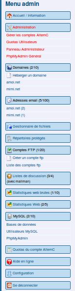

Après authentification, l’administrateur des comptes AlternC accède au
bureau virtuel du compte « admin ».

L’utilisation des liens en bleu est la même que pour tout compte
AlternC. Nous nous intéresserons ici, exclusivement, aux liens de
couleur rouge.

### Le compte admin AlternC

L’ « *admin AlternC* » peut créer un compte, lui attribuer des quotas
(noms de domaine, comptes mails, listes de discussion, ...), lui
conférer des droits d’administration, le bloquer, le supprimer, s’y
connecter et donc consulter tous ses fichiers ...

Le mot de passe du compte « *admin* » doit être un VRAI mot de passe
(mélange de chiffres, de caractères spéciaux et de lettres minuscules et
majuscules), c’est un compte sensible qui donne accès à tous les comptes
hébergés sur le serveur.

Le menu du bureau virtuel est semblable à celui de l’utilisateur d’un
compte à une rubrique près, la rubrique Administration, reproduite
ci-dessous.

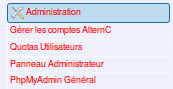

### Liste des comptes

Un clic sur le lien « *Gérer les comptes AlternC* » affiche la liste des
comptes hébergés sur le serveur dans la partie droite du bureau.

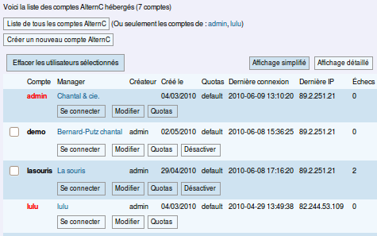

Il y a sept comptes actuellement hébergés sur ce serveur. La copie
d'écran ci-dessus est une vue partielle de la liste de tous ces comptes
créés par « admin » ou par « lulu ».

En jouant sur le bouton \[Liste de tous les comptes AlternC\] ou en
cliquant sur les liens bleus de la phrase « (Ou seulement les comptes de
: admin, lulu) » nous afficherions uniquement les comptes créés par l'un
ou l'autre de ces administrateurs.

Dans cette liste les comptes inscrits en rouge sont des comptes
administrateur ou administrateur restreint (cas de « lulu »). Les
prérogatives des administrateurs restreints seront décrites plus loin.

Nous allons nous intéresser à la liste des comptes. Elle est présentée
sous forme de tableau. Pour chaque compte deux lignes donnent des
informations ou l'accès à des actions.

Voici la partie concernant le compte « test »

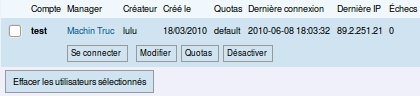
* une case à cocher précède le nom du compte (utilisée pour supprimer
    le compte)
* le nom du compte (nom d’utilisateur), ici « test » est un lien qui
    pointe vers l'adresse email de l'utilisateur du compte
* le créateur de ce compte est « lulu » (administrateur restreint)
* ce compte a été créé le 18 mars 2010
* les quotas en domaines, emails, base de données... sont les quotas
    définis par défaut
* la dernière connexion à ce compte date du 8 juin 2010 à 18h3mn32s
* cette connexion a été réalisée depuis l'IP 89.2.251.21
* aucun échec du à une erreur de login ou de mot de passe n'est à
    signaler depuis la dernière connexion réussie.
* le bouton \[Connecter\] permet de se connecter au compte, bien
    évidemment il ne doit être utilisé que pour résoudre un problème à
    la demande de l'utilisateur concerné.
* le bouton \[Modifier\] permet la modification des informations
    personnelles du compte
* le bouton \[Quotas\] concerne la gestion des quotas d’un compte
* le bouton \[Désactiver\] bloquera l'accès au compte.

Toutes ces informations et fonctionnalités sont précieuses pour le
gestionnaire des comptes AlternC.

Par exemple, si nous nous reportons à la copie d'écran de la liste des
comptes nous constatons que le compte « lasouris » présente 2 échecs de
connexion . Le fait de connaitre la date et l’heure de connexion ainsi
que l’IP de la machine concernée permet d’engager des recherches si les
tentatives se multiplient.

Nous constatons également que l'utilisateur « mimi » ne s’est jamais
connecté à son compte.

Si le nombre de comptes est important il est possible d'afficher une vue
simplifiée de la liste. Cette vue offre les mêmes fonctionnalités de
connexion, suppression, modification, gestion des quotas.

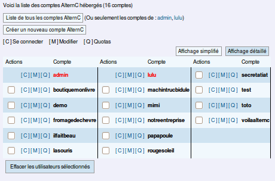
C’est également depuis cette page que l’on peut créer un nouveau compte
en cliquant sur le bouton \[Créer un nouveau compte AlternC\].

***Remarque **: Il n'est pas possible de supprimer un compte
administrateur ou administrateur restreint. Pour le supprimer il est
nécessaire de changer son statut au préalable, voir ci-après dans le
chapitre Modifier un compte*

### 

### Créer un compte AlternC

La création d’un nouveau compte AlternC est aussi aisée que la création
d’une adresse email :

* Clic sur le bouton \[Créer un nouveau compte AlternC\]
* Renseignement du formulaire
* Validation en cliquant sur le bouton \[Créer ce compte AlternC\]

<!-- -->
* 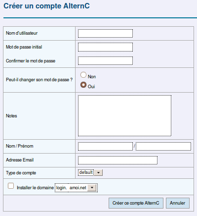

	**Nom d'utilisateur** : nom du compte (identifie le compte et sert
	à l’authentification pour la connexion au bureau virtuel), pas
    d'accents ou d'espaces.
* **Mot de passe initial** : ce mot de passe (à confirmer dans le
    champ suivant) pourra être changé (ou non) par le gestionnaire du
    compte si l’autorisation lui en est donnée (Peut-il changer son mot
    de passe ?)
* **Notes** : Particularités éventuelles du compte
* **Nom / Prénom** : l’identité du propriétaire du compte, ou l’usage
    du compte (ex : test)
* **Adresse Email** : adresse à laquelle seront envoyées les
    informations de mise à jour, indisponibilité... du serveur.
* **Type de compte** : concerne les quotas, laisser à priori sur
    « default », nous y reviendrons.
* **Installer le domaine ...** : permet d'installer automatiquement
    un sous-domaine d'un domaine installé sur le serveur (liste
    déroulante).

- **Remarque**: Le nom du propriétaire du compte n’est pas obligatoirement
                celui du gestionnaire du compte.

### 

### Modifier un compte AlternC

Un clic sur le bouton \[Modifier\] du compte concerné dans la liste
détaillée des comptes AlternC (ou du bouton \[M\] pour la liste
simplifiée), permet de changer certaines informations.

L’utilisation en est simple, il suffit de modifier les données du
formulaire.

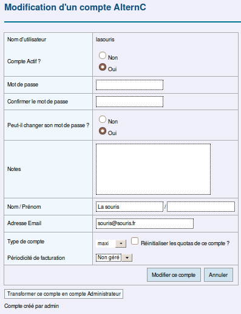

Le fait de passer le champ «  *Compte Actif* » de oui vers non,
verrouille l’accès au compte. Repasser sur oui, déverrouille.

Si la modification ne vise pas le changement de mot de passe il faut
laisser les champs mot de passe non remplis. Le mot de passe initial
sera conservé.

Type de compte concerne les quotas, nous en parlerons plus loin.

La périodicité de facturation est activée de manière très spécifique sur
certains serveurs. Ce n'est pas le cas courant.

**Attention **: le bouton \[Transformer ce compte en compte
d’Administrateur\] donne à l'utilisateur du compte le droit de créer
lui-même des comptes. À manipuler donc avec précaution et après
formation de l'utilisateur.

### 

### Gérer les quotas d’un compte AlternC

Par défaut, des quotas sont définis en matière de comptes mails, noms de
domaines, comptes FTP, ...). Nous verrons par la suite comment définir
ces quotas par défaut.

Ici nous allons personnaliser les quotas attribués au compte
« lasouris ». Pour cela nous avons cliqué sur le bouton \[Quotas\]
associé au compte « lasouris » dans la liste des compte AlternC (ou sur
le bouton \[Q\] dans la liste simplifiée).

Les champs du formulaire permettent d’entrer les nouveaux quotas pour
chaque élément. Une colonne indique les quotas utilisés avant
modification (ici, 1 Nom de domaine et 2 bases de données sont, soit la
totalité des quotas pour ces services, ce pourquoi l’intitulé s'affiche
en rouge.).

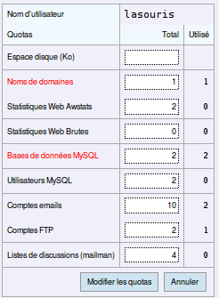
Cliquer sur le bouton \[Modifier les quotas\] pour enregistrer les
modifications...

### Se connecter à un compte AlternC depuis le compte « admin »

Avant de cliquer sur le bouton \[Connecter\] associé à un compte (ou le
bouton \[C\] pour la liste simplifiée), **assurez-vous que l'utilisateur
ou le propriétaire du compte vous en a donné le droit.**

**Attention** : ne pas ouvrir ce lien dans un nouvel onglet (ou une
nouvelle fenêtre) du navigateur. En effet, la connexion simultanée à
plusieurs bureaux virtuels d’un même serveur ne fonctionne pas, elle est
donc à proscrire, les informations risquant de se mélanger à
l'affichage...

Le bureau virtuel du compte choisi s’affiche à la place de celui du
compte « *admin* ». Pour retourner au compte « *admin* » il sera
nécessaire de se déconnecter du compte en cours puis de se reconnecter
en s’identifiant.

Quotas utilisateurs
-------------------

Depuis le lien « *Quotas utilisateurs* » du menu, l’administrateur
AlternC visualise l’utilisation de l’espace pour chaque compte, soit en
Mo, soit en pourcentage d’occupation du serveur (chiffres ou
graphiques), en affichant ou non les noms de domaine concernés.

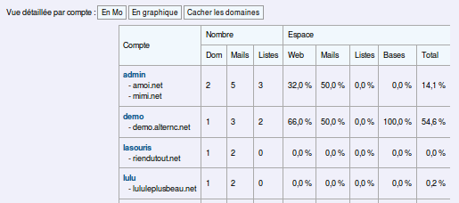
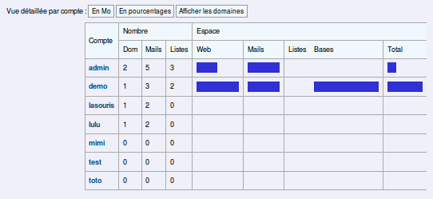
Panneau administrateur
----------------------

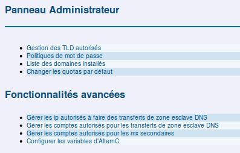
Un clic sur le bouton \[Panneau administrateur\] donne, pour
l’administrateur des comptes AlternC, accès à un panel d’actions pour la
gestion du serveur.

### Fonctionnalités simples

#### Gestion des TLD autorisés

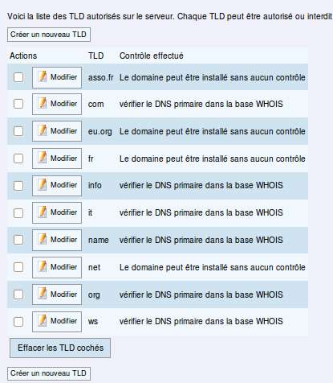
Un TLD (Top Level Domain) est un domaine de premier niveau : .fr, .net,
.org... sont des domaines de premier niveau.

Le fait de vérifier les DNS dans le WHOIS mondial évite l’installation
fantaisiste de domaines n’existant pas et qui ne fonctionneront pas !

Il est toutefois pratique de pourvoir changer le mode de contrôle. C’est
important pour certains TLD.

**Attention **: le TLD **.fr** doit être installé sur le serveur avant
d’être acheté. Il faut donc autoriser son installation sans contrôle
dans le Whois.

Pour **changer la gestion d’un TLD** il suffit de cliquer sur l’icône
crayon à côté de son nom, comme le montre l’exemple ci-dessous.

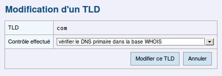

Pour modifier le type de contrôle effectué il suffit de sélectionner
celui souhaité depuis le menu déroulant.

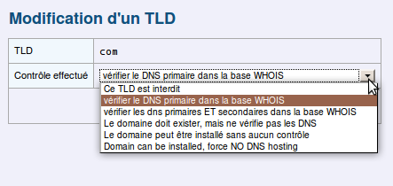
Puis de cliquer sur le bouton \[Modifier ce TLD\].

Il est également possible de **créer de nouveaux TLD, **mot impropre ici
puisqu’il s’agit de gérer l'autorisation d'un domaine de premier niveau
non supporté par AlternC, ou de donner à un nom de domaine de second
niveau les prérogatives d’un nom de domaine de premier niveau sur le
serveur concerné.

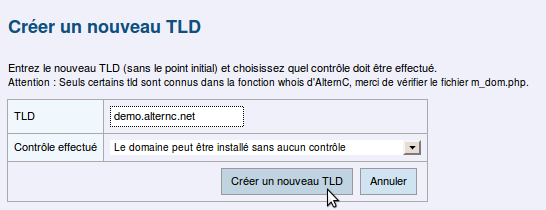
Dans cet exemple, tous les sous-domaines en demo.alternc.net peuvent
être installés sans contrôle préalable, ce qui est indispensable
puisqu’il s’agit d’un sous-domaine et non d’un domaine acheté chez un
registrar. Bien évidemment, le domaine « demo.alternc.net », ainsi doté
des droits de TLD, doit lui-même être installé sur le serveur
auparavant.

#### Politique de mots de passe

Ce lien vous permet de gérer une politique de mot de passe pour chaque
endroit où un mot de passe est requis dans les service d’AlternC, afin
de renforcer la sécurité sur votre serveur.

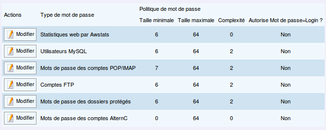
Pour chaque type de mot de passe, vous pouvez choisir la politique qui
sera appliquée.

* tailles minimale et maximale pour le mot de passe, nous vous
    suggérons un minimum de 6,
* complexité : nombre de classes de caractères différentes que ce mot
    de passe doit contenir (les classes sont décrites au-dessous du
    formulaire), nous vous suggérons un minimum de 2.
* interdiction, ou non, de choisir un mot de passe ressemblant au nom
    d’utilisateur, nous vous suggérons vivement de l’interdire.

Dans la copie d'écran ci-dessus nous constatons que les mots de passe
des comptes AlternC peuvent avoir une taille minimale de 0 caractère !

Nous allons modifier ceci.

Un clic sur le bouton \[Modifier\] précédant le type de mot de passe
affiche le formulaire suivant

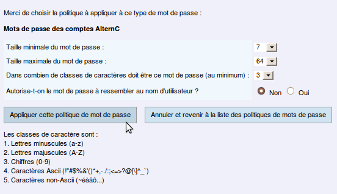

Pour valider, cliquer sur le bouton \[Appliquer cette politique de mot
de passe\].

Nous précisons que la politique choisie pour les mots de passe des
comptes POP/IMAP des adresses email s'applique bien évidemment, tout
autant depuis le bureau AlternC que depuis le webmail squirrelmail.

#### 

#### Liste des domaines installés sur le serveur

Ce lien affiche l’ensemble des domaines installés sur le serveur en
précisant le compte AlternC auquel il est lié.

Le verrouillage du domaine interdit la modification des paramètres DNS
de ce domaine et donc sa migration vers un autre compte ou serveur. Ce
verrouillage peut également éviter de fausses manipulations de la part
d’un utilisateur de compte AlternC, dans ce cas la zone des paramètres
DNS ne s'affiche plus sur le bureau de l'utilisateur (voir le chapitre
« Nom de domaine / paramètres du domaine installé sur le serveur).

**Attention **: ne pas confondre le verrouillage d’un nom de domaine et
celui d’un compte AlternC, voir « Modifier un compte AlternC ».

La colonne « OK ? » est verte quand le domaine existe dans le registre
DNS mondial et que sa configuration IP, NS et MX est correcte. Il est
rouge lorsque le serveur a de sérieux doutes sur sa configuration NS, MX
ou IP. Vérifiez auprès du propriétaire de ce domaine, et si besoin
contactez un administrateur système.

Si vous voulez forcer la vérification des NS, MX et IP des domaines,
cliquez le lien « Afficher la liste des domaines avec des informations
NS, MX et IP à jour ».

Ici (serveur de tests) tous les domaines installés le sont à tort voire
sont farfelus mais pour l'exemple nous avons validé le domaine « 
demo.alternc.net ».

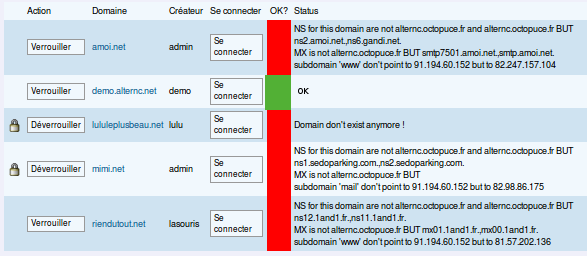Amoi.net
existe mais il est installé sur un autre serveur, il en est de même pour
mimi.net et riendutout.net dont l'hébergeur est « 1 and 1 ».

lululeplusbeau.net n'existe pas.

#### Changer les quotas par défaut

Chaque compte AlternC dispose de fonctionnalités telles que définies
par l’administrateur AlternC.

Un clic sur le lien«  *Changer les quotas par défaut* » dans le
« *Panneau Administrateur* » nous informe du nombre de jeux de
statistiques, de noms de domaine, comptes FTP, comptes email...
attribués automatiquement aux nouveaux comptes créés.

Le type de quotas créé par défaut à l'installation d'AlternC se nomme
« default ».

Il est possible de modifier ces valeurs pour les adapter aux besoins de
l'hébergeur.

Il est également possible de créer plusieurs types de quotas. A la
création d'un compte AlternC il sera ainsi possible de choisir le type
de quota adapté au compte.

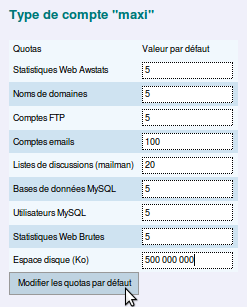

Voici la création d'un type de quota « maxi »

Il est possible de créer plusieurs types de quotas.

Et voici la création d'un compte disposant de ce type de quotas
(utilisation du menu déroulant).

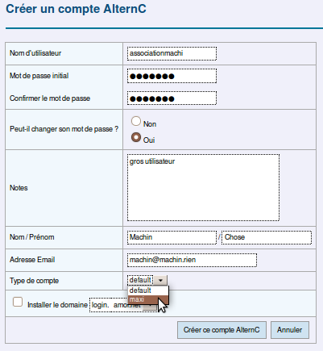
### Fonctionnalités avancées

#### A manipuler avec précaution, voire pas du tout !

##### « Gérer les ip autorisés à faire des transferts de zone esclave DNS »

##### « Gérer les comptes autorisés pour les transferts de zone esclave DNS »

##### « Gérer les comptes autorisés pour les mx secondaires »

L’utilisation de ces 3 liens du panneau administrateur nécessite des
connaissances en administration système. Il s’agit de la communication
entre le serveur, les serveurs de DNS et de sauvegarde.

Il est prudent d’en laisser la complète gestion à l’administrateur
système (**root**) du serveur, sous peine d'être confronté à de graves
dysfonctionnements !

Ils seront décrits dans le chapitre sur l'administration système et
AlternC.

#### Configurer les variables d’AlternC

De même, la configuration des variables d'AlternC est réservée aux
administrateurs systèmes avertis. Seule la variable « hosting\_tld » est
susceptible d'être remplie par un non-informaticien :

Cette variable permet, si vous indiquez un nom de domaine dont vous êtes
propriétaire (exemple NomDeDomaine.tld), d'assortir automatiquement tout
nouveau compte AlternC créé par vos soins d’un sous-domaine de type

LoginDuCompte.NomDeDomaine.tld.

*Exemple* : pour le nom de domaine structure.fr peuvent être créés :
atelier.structure.fr, mjc.structure.fr, filiale.structure.fr .… qui à
leur tour peuvent bénéficier de sous-domaines (exemple :
congres.filiale.structure.fr …)

PhpMyAdmin Général
------------------

le lien «  PhpMy*Admin SQL Général* » ouvre une fenêtre du navigateur
sur toutes les bases de données contenues par le serveur, y compris la
base système, à l’aide du logiciel PhpMyAdmin, inclus dans la plateforme
AlternC.

Cette possibilité doit être utilisée avec une extrême prudence, par des
personnes compétentes.

L’accès requiert d’ailleurs une identification spécifique, indépendante
de celle du compte AlternC admin, afin de prévenir toute manipulation
erronée.

Modifier les prérogatives de l’admin AlternC
--------------------------------------------

### Limiter les prérogatives de l’Administrateur AlternC

En fonction des compétences de la personne, pour pallier toute erreur de
manipulation, il est possible de limiter les prérogatives de
l’administrateur des comptes AlternC à la gestion des comptes par
exemple. Il n’aura donc pas accès à tous les liens du Panneau
Administateur.

### Administrateur restreint

Il n’existe qu’un compte admin pour un serveur donné sur une plateforme
AlternC. D’autres administrateurs de comptes peuvent être crées, ils
auront accès à la gestion des seuls comptes qu’ils auront eux-même
créés, et non à la totalité des comptes hébergés sur le serveur. Bien
évidemment ils seront limités également pour les liens du Panneau
Administrateur.

### Étendre les prérogatives de l’Administrateur AlternC

Il est à contrario possible d’étendre les prérogatives de
l’Administrateur des comptes AlternC : accès en SSH au serveur en
utilisateur autorisé pour certaines actions, accès en SSH au serveur en
mode « root », soit accès à toutes les manipulations possibles sur le
serveur.

Attention, cette extension peut être totalement incompatible avec la
garantie de votre hébergeur, puisqu'elle vous donne des accès
quasi-illimité au serveur.

